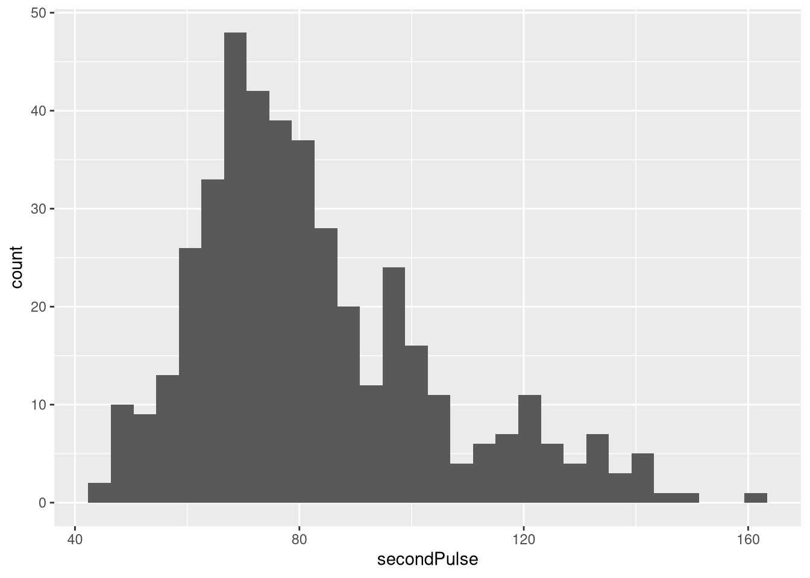
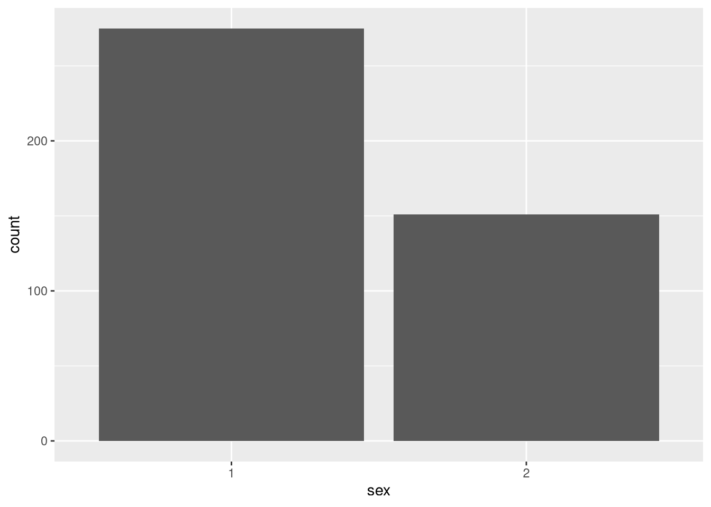
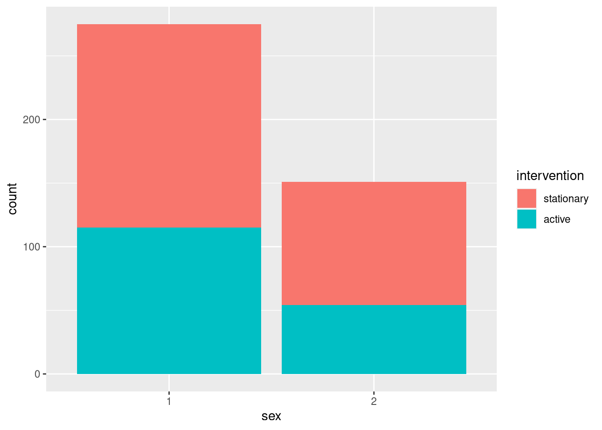
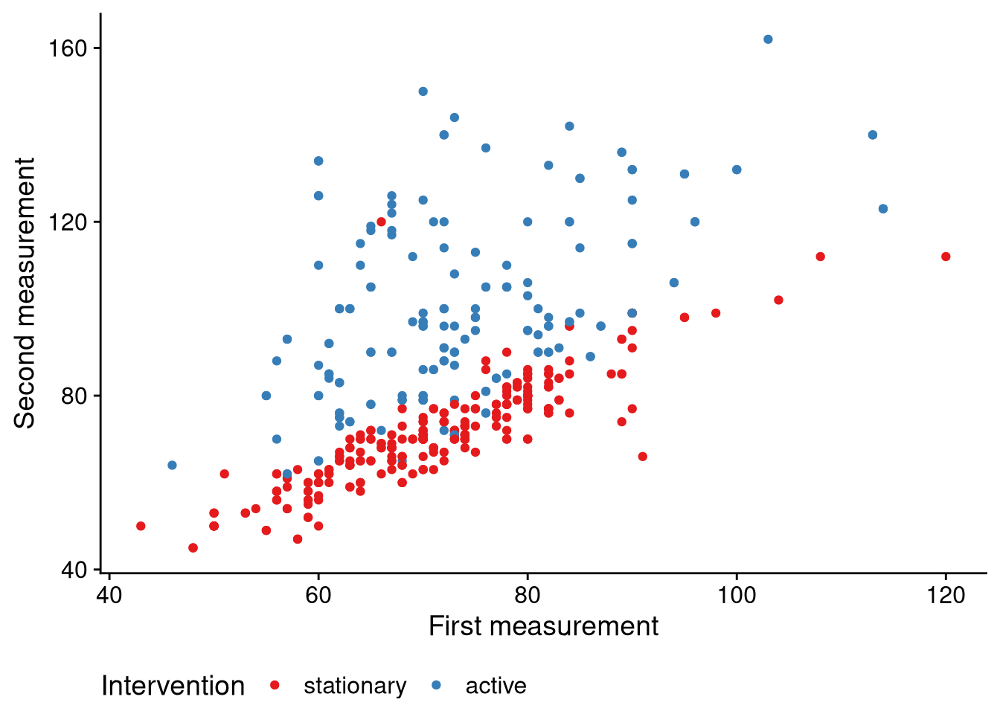

# Lecture 3: Plots and table1


```r
library(tidyverse)  # General data wrangling & plots
library(knitr)      # Tables 
library(kableExtra) # Fancy tables
library(cowplot)    # For pretty plots
library(table1)     # Table1
library(here)       # paths
```

We begin by loading in our data:


```r
pulse <- read_csv2("https://notendur.hi.is/thj73/data/pulseEn.csv")
pulse
#> # A tibble: 471 × 10
#>       id height weight   age   sex smokes drinks firstPulse
#>    <dbl>  <dbl>  <dbl> <dbl> <dbl> <chr>  <chr>       <dbl>
#>  1     1    161     60    23     1 no     no             83
#>  2     2    185    115    52     2 <NA>   yes            80
#>  3     3    167     NA    22     1 no     yes            43
#>  4     4    174     67    21     1 no     yes            76
#>  5     5    163     57    20     1 no     yes            71
#>  6     6    175     59    20     1 no     yes            65
#>  7     7    178     70    39     1 <NA>   yes            77
#>  8     8    191     94    21     2 no     yes            79
#>  9     9    176     68    20     1 no     yes            73
#> 10    10    176     82    70     2 no     yes            65
#> # … with 461 more rows, and 2 more variables:
#> #   secondPulse <dbl>, intervention <chr>
```

The data `pulse` is based on an Icelandic data set the pulse of students was measured at two different time points. There were two groups; the control group which was stationary between the two measurements, and then the case group which were active between the two measurements. The original data was in Icelandic so I had to translate the columns and levels of the factor variables. I also omitted some variables for simplicity's sake. If you are curious about the translation you can look at the Appendix at the bottom of this document.

The goal of today's lecture is to compare the two groups. We will do so graphically and with tables. We begin by using the `glimpse()` function to get a brief overview of the data.


```r
glimpse(pulse)
#> Rows: 471
#> Columns: 10
#> $ id           <dbl> 1, 2, 3, 4, 5, 6, 7, 8, 9, 10, 11, 12…
#> $ height       <dbl> 161, 185, 167, 174, 163, 175, 178, 19…
#> $ weight       <dbl> 60, 115, NA, 67, 57, 59, 70, 94, 68, …
#> $ age          <dbl> 23, 52, 22, 21, 20, 20, 39, 21, 20, 7…
#> $ sex          <dbl> 1, 2, 1, 1, 1, 1, 1, 2, 1, 2, 2, 2, 1…
#> $ smokes       <chr> "no", NA, "no", "no", "no", "no", NA,…
#> $ drinks       <chr> "no", "yes", "yes", "yes", "yes", "ye…
#> $ firstPulse   <dbl> 83, 80, 43, 76, 71, 65, 77, 79, 73, 6…
#> $ secondPulse  <dbl> 84, 103, 52, 105, 68, 65, 75, 83, 90,…
#> $ intervention <chr> "stationary", "active", "stationary",…
```

We see that there are three `chr` variables (`smokes`, `drinks`, `intervention`) which we want to cast as factor variables. Furthermore, even though sex is a `dbl` we should cast as a factor variable as well.


```r
pulse <-
    pulse %>% 
    mutate(sex = factor(sex), 
           smokes = factor(smokes), 
           drinks = factor(drinks), 
           intervention = factor(intervention, 
                                 levels = c('stationary', 'active')))
```

Having done so, we now use the `summary()` function to get a quick overview of the data:


```r
summary(pulse)
#>        id            height           weight      
#>  Min.   :  1.0   Min.   : 150.0   Min.   : 40.00  
#>  1st Qu.:118.5   1st Qu.: 166.0   1st Qu.: 60.00  
#>  Median :236.0   Median : 172.0   Median : 70.00  
#>  Mean   :236.0   Mean   : 179.6   Mean   : 85.38  
#>  3rd Qu.:353.5   3rd Qu.: 181.0   3rd Qu.: 81.00  
#>  Max.   :471.0   Max.   :1725.0   Max.   :846.00  
#>                  NA's   :1        NA's   :10      
#>       age        sex      smokes     drinks   
#>  Min.   :19.00   1:307   no  :412   no  : 76  
#>  1st Qu.:20.00   2:164   yes : 46   yes :389  
#>  Median :22.00           NA's: 13   NA's:  6  
#>  Mean   :24.24                                
#>  3rd Qu.:25.00                                
#>  Max.   :70.00                                
#>                                               
#>    firstPulse      secondPulse         intervention
#>  Min.   : 42.00   Min.   : 42.00   stationary:286  
#>  1st Qu.: 64.00   1st Qu.: 68.00   active    :183  
#>  Median : 71.50   Median : 77.00   NA's      :  2  
#>  Mean   : 71.98   Mean   : 82.21                   
#>  3rd Qu.: 80.00   3rd Qu.: 93.00                   
#>  Max.   :120.00   Max.   :162.00                   
#>  NA's   :17       NA's   :14
```

For the first time we see some missing values. Note the NA's for `height`, `weight`, `firstPulse`, `secondPulse`, and so on. Missing values can be imputed but that is beyond the scope of this course. Instead, we are just going to remove them from our data with the `na.omit()` function.


```r
pulse <- 
    pulse %>%
    na.omit()
```

Let's use the `summary()` function again to see what has changed:


```r
summary(pulse)
#>        id            height           weight      
#>  Min.   :  1.0   Min.   : 150.0   Min.   : 40.00  
#>  1st Qu.:116.2   1st Qu.: 165.0   1st Qu.: 60.00  
#>  Median :237.5   Median : 172.0   Median : 70.00  
#>  Mean   :237.1   Mean   : 180.3   Mean   : 84.89  
#>  3rd Qu.:358.8   3rd Qu.: 181.0   3rd Qu.: 81.00  
#>  Max.   :471.0   Max.   :1725.0   Max.   :846.00  
#>       age        sex     smokes    drinks   
#>  Min.   :19.00   1:275   no :384   no : 65  
#>  1st Qu.:20.00   2:151   yes: 42   yes:361  
#>  Median :22.00                              
#>  Mean   :23.92                              
#>  3rd Qu.:25.00                              
#>  Max.   :70.00                              
#>    firstPulse      secondPulse         intervention
#>  Min.   : 43.00   Min.   : 45.00   stationary:257  
#>  1st Qu.: 64.00   1st Qu.: 68.00   active    :169  
#>  Median : 72.00   Median : 78.00                   
#>  Mean   : 72.21   Mean   : 82.59                   
#>  3rd Qu.: 80.00   3rd Qu.: 94.75                   
#>  Max.   :120.00   Max.   :162.00
```

All the NA's are gone but at the cost of a reduced data set. When you conduct your research its important that you try to minimize missing values as it affects the power of the study.

## Table 1
The most important table we create is *table 1*. Table 1 contains all the descriptive statistics of our cohort, preferably stratified by case/control, but not necessarily. It is called table 1 because it is often the first table you see in a paper.

There are many ways to create table 1 but I will only discuss how to do it with the `table1` package. Using `table1` is pretty simple. We begin by writing down all the variables we are interested in and we tell the function to stratify by the group of interest. For us, the `intervention` variable is the one we want to stratify by. 


```r
table1(~ firstPulse + secondPulse + height + weight + age + sex + smokes + drinks | intervention, data = pulse)
```

```{=html}
<div class="Rtable1"><table class="Rtable1">
<thead>
<tr>
<th class='rowlabel firstrow lastrow'></th>
<th class='firstrow lastrow'><span class='stratlabel'>stationary<br><span class='stratn'>(N=257)</span></span></th>
<th class='firstrow lastrow'><span class='stratlabel'>active<br><span class='stratn'>(N=169)</span></span></th>
<th class='firstrow lastrow'><span class='stratlabel'>Overall<br><span class='stratn'>(N=426)</span></span></th>
</tr>
</thead>
<tbody>
<tr>
<td class='rowlabel firstrow'>firstPulse</td>
<td class='firstrow'></td>
<td class='firstrow'></td>
<td class='firstrow'></td>
</tr>
<tr>
<td class='rowlabel'>Mean (SD)</td>
<td>71.0 (11.0)</td>
<td>74.0 (12.3)</td>
<td>72.2 (11.6)</td>
</tr>
<tr>
<td class='rowlabel lastrow'>Median [Min, Max]</td>
<td class='lastrow'>71.0 [43.0, 120]</td>
<td class='lastrow'>72.0 [46.0, 114]</td>
<td class='lastrow'>72.0 [43.0, 120]</td>
</tr>
<tr>
<td class='rowlabel firstrow'>secondPulse</td>
<td class='firstrow'></td>
<td class='firstrow'></td>
<td class='firstrow'></td>
</tr>
<tr>
<td class='rowlabel'>Mean (SD)</td>
<td>71.1 (12.0)</td>
<td>100 (20.9)</td>
<td>82.6 (21.5)</td>
</tr>
<tr>
<td class='rowlabel lastrow'>Median [Min, Max]</td>
<td class='lastrow'>70.0 [45.0, 120]</td>
<td class='lastrow'>96.0 [62.0, 162]</td>
<td class='lastrow'>78.0 [45.0, 162]</td>
</tr>
<tr>
<td class='rowlabel firstrow'>height</td>
<td class='firstrow'></td>
<td class='firstrow'></td>
<td class='firstrow'></td>
</tr>
<tr>
<td class='rowlabel'>Mean (SD)</td>
<td>179 (97.3)</td>
<td>183 (110)</td>
<td>180 (103)</td>
</tr>
<tr>
<td class='rowlabel lastrow'>Median [Min, Max]</td>
<td class='lastrow'>171 [150, 1730]</td>
<td class='lastrow'>173 [152, 1610]</td>
<td class='lastrow'>172 [150, 1730]</td>
</tr>
<tr>
<td class='rowlabel firstrow'>weight</td>
<td class='firstrow'></td>
<td class='firstrow'></td>
<td class='firstrow'></td>
</tr>
<tr>
<td class='rowlabel'>Mean (SD)</td>
<td>92.5 (118)</td>
<td>73.3 (35.8)</td>
<td>84.9 (95.1)</td>
</tr>
<tr>
<td class='rowlabel lastrow'>Median [Min, Max]</td>
<td class='lastrow'>70.0 [40.0, 846]</td>
<td class='lastrow'>70.0 [46.0, 495]</td>
<td class='lastrow'>70.0 [40.0, 846]</td>
</tr>
<tr>
<td class='rowlabel firstrow'>age</td>
<td class='firstrow'></td>
<td class='firstrow'></td>
<td class='firstrow'></td>
</tr>
<tr>
<td class='rowlabel'>Mean (SD)</td>
<td>23.7 (5.68)</td>
<td>24.3 (8.26)</td>
<td>23.9 (6.82)</td>
</tr>
<tr>
<td class='rowlabel lastrow'>Median [Min, Max]</td>
<td class='lastrow'>22.0 [19.0, 54.0]</td>
<td class='lastrow'>21.0 [19.0, 70.0]</td>
<td class='lastrow'>22.0 [19.0, 70.0]</td>
</tr>
<tr>
<td class='rowlabel firstrow'>sex</td>
<td class='firstrow'></td>
<td class='firstrow'></td>
<td class='firstrow'></td>
</tr>
<tr>
<td class='rowlabel'>1</td>
<td>160 (62.3%)</td>
<td>115 (68.0%)</td>
<td>275 (64.6%)</td>
</tr>
<tr>
<td class='rowlabel lastrow'>2</td>
<td class='lastrow'>97 (37.7%)</td>
<td class='lastrow'>54 (32.0%)</td>
<td class='lastrow'>151 (35.4%)</td>
</tr>
<tr>
<td class='rowlabel firstrow'>smokes</td>
<td class='firstrow'></td>
<td class='firstrow'></td>
<td class='firstrow'></td>
</tr>
<tr>
<td class='rowlabel'>no</td>
<td>230 (89.5%)</td>
<td>154 (91.1%)</td>
<td>384 (90.1%)</td>
</tr>
<tr>
<td class='rowlabel lastrow'>yes</td>
<td class='lastrow'>27 (10.5%)</td>
<td class='lastrow'>15 (8.9%)</td>
<td class='lastrow'>42 (9.9%)</td>
</tr>
<tr>
<td class='rowlabel firstrow'>drinks</td>
<td class='firstrow'></td>
<td class='firstrow'></td>
<td class='firstrow'></td>
</tr>
<tr>
<td class='rowlabel'>no</td>
<td>41 (16.0%)</td>
<td>24 (14.2%)</td>
<td>65 (15.3%)</td>
</tr>
<tr>
<td class='rowlabel lastrow'>yes</td>
<td class='lastrow'>216 (84.0%)</td>
<td class='lastrow'>145 (85.8%)</td>
<td class='lastrow'>361 (84.7%)</td>
</tr>
</tbody>
</table>
</div>
```

We see a good summary of our data: means, ranges, standard deviations, number of observations, counts and percentages. By examining this table we get a good feel for the data in a relatively short time. Can you see a difference between the two groups? Do you see anything weird in the table?

### Note: using tidyverse functions
It is actually possible to recreate the table above with `group_by()`, `summarize()`, and so on. It's quite involved but if you want a challenge I encourage you to try it.

## Summarizing the data with plots
Tables are good and all but a picture is worth a thousand words; it's time to create some plots.

### Scatter plot or `geom_point()`
We have seen this one before. Let's plot the values of `firstPulse` against `secondPulse` and color points based on whether the observation is from the active or stationary group.


```r
pulse %>%
    ggplot(aes(x = firstPulse, y = secondPulse, color = intervention)) +
    geom_point()
```


There is a lot of information on this simple graph. We see that:

1. For the stationary group, the higher their starting pulse, the higher their second pulse (in general).

2. The active group has a much higher second pulse.

3. One individual in the stationary group has a much higher second pulse relative to their starting pulse. Why?

This plot is nice and all but we should invest some time into making it more aesthetically pleasing. We will pick sharper colors, relabel our axes, and move the legend down to the bottom of the graph. We will also load a theme for the plot from the `cowplots` package. 


```r
pulse %>%
    ggplot(aes(x = firstPulse, y = secondPulse, color = intervention)) +
    geom_point() +
    scale_color_brewer(type = 'seq', palette = 'Set1') + # Change color
    labs(x = 'First measurement', 
         y = 'Second measurement', 
         color = 'Intervention') + # Change labels on axes, change legend
    theme_cowplot() +    # change the theme
    theme(legend.position = 'bottom')
```


Note that "aesthetically pleasing" is relative. 

### Data distribution plots or `geom_histogram()`
We have multiple continuous variables to play with. Let's look at the distribution of the pulse measurements.


```r
pulse %>%
    ggplot(aes(x = firstPulse)) +
    geom_histogram()
#> `stat_bin()` using `bins = 30`. Pick better value with
#> `binwidth`.
```


```r
pulse %>%
    ggplot(aes(x = secondPulse)) +
    geom_histogram()
#> `stat_bin()` using `bins = 30`. Pick better value with
#> `binwidth`.
```



When we look at first picture we see that the most of the "mass" is between 60 and 80. This is in agreement with what we saw in table 1. The second picture shows that the distribution is bimodal; that is, there seem to be two peaks. This is also consistent with what we have seen before as there are two groups with the active group having a much larger second pulse measurement.

Maybe if we color the second histogram using the intervention variable we can better see these two peaks.


```r
pulse %>%
    ggplot(aes(x = secondPulse, fill = intervention)) +
    geom_histogram()
#> `stat_bin()` using `bins = 30`. Pick better value with
#> `binwidth`.
```


This is better but again we should invest some time into cleaning the graph. We will repeat the steps for the scatter plot with one addition; we will make colors a little transparent with the `alpha` parameter as the two histograms overlap each other.


```r
pulse %>%
    ggplot(aes(x = secondPulse, fill = intervention)) +
    geom_histogram(alpha = 0.5, position = 'identity') +
    scale_fill_brewer(type = 'seq', palette = 'Set1') +
    labs(x = 'Second measurement', 
         fill = 'Intervention') +
    theme_cowplot() +
    theme(legend.position = 'bottom')
#> `stat_bin()` using `bins = 30`. Pick better value with
#> `binwidth`.
```


### `geom_boxplot()` as an alternative to `geom_histogram()`
Another important plot which compares the distribution of two or more variables is the boxplot. The boxplot shows us the range of the data, outliers, and the median.


```r
pulse %>%
    ggplot(aes(x = intervention, y = secondPulse)) +
    geom_boxplot()
```


This basically contains the same information as histogram. Can you see it?

### `geom_density()` as an alternative to `geom_histogram()` and `geom_boxplot()`
This is another (essentially) version of the previous two plots. 


```r
pulse %>%
    ggplot(aes(x = secondPulse, fill = intervention)) +
    geom_density(alpha = 0.5) +
    scale_fill_brewer(type = 'seq', palette = 'Set1') +
    theme_cowplot() +
    labs(x = 'Second measurement', 
         fill = 'Intervention') + 
    theme(legend.position = 'bottom')
```


### Barplots for discrete variables `geom_bar()`
So far we have only been paying attention to the continuous variable. Let's turn our attention to the discrete ones. The discrete variables are `sex`, `smoker`, `drinks` and `intervention`.

Let's plot the barplot for `sex`:


```r
pulse %>%
    ggplot(aes(x = sex)) +
    geom_bar()
```


This is honestly a pretty boring plot. We can spice things up a little by adding the `intervention` variable.


```r
pulse %>%
    ggplot(aes(x = sex, fill = intervention)) +
    geom_bar()
```



The bars are stacked on top of each other which is annoying. It would be better if they were side-by-side. 


```r
pulse %>%
    ggplot(aes(x = sex, fill = intervention)) +
    geom_bar(position = 'dodge')
```


Of course we can improve the aesthetics of the graph like we did with the other ones.

### Splitting plots into facets with `facet_grid()`
Recall the scatter plot from before:


```r
pulse %>%
    ggplot(aes(x = firstPulse, y = secondPulse, color = intervention)) +
    geom_point() +
    scale_color_brewer(type = 'seq', palette = 'Set1') + # Change color
    labs(x = 'First measurement', 
         y = 'Second measurement', 
         color = 'Intervention') + # Change labels on axes, change legend
    theme_cowplot() +    # change the theme
    theme(legend.position = 'bottom')
```



Instead of having the points for static and activity together we can split the plot in two. The code needs to be modified a little but it's not that much work.


```r
pulse %>%
    ggplot(aes(x = firstPulse, y = secondPulse)) +
    geom_point() +
    labs(x = 'First measurement', 
         y = 'Second measurement') + # Change labels on axes, change legend +
    facet_grid(~intervention, scales = 'free') +
    theme_cowplot() +    # change the theme
    theme(legend.position = 'bottom')
```


Each group gets its own plot. Sometimes it's easier to compare plots this way.


## Saving our plots
We use the `ggsave()` function to save our plots locally. Before save a plot we need to store it as an object in memory. Let's save our scatter plot.


```r
p <- 
    pulse %>%
    ggplot(aes(x = firstPulse, y = secondPulse, color = intervention)) +
    geom_point() +
    scale_color_brewer(type = 'seq', palette = 'Set1') + # Change color
    labs(x = 'First measurement', 
         y = 'Second measurement', 
         color = 'Intervention') + # Change labels on axes, change legend
    theme_cowplot() +    # change the theme
    theme(legend.position = 'bottom')
```


```r
ggsave(filename = here('img', 'scatterPlot.png'), plot = p, width = 8, height = 6, dpi = 320)
```

## Appendix


```r
library(tidyverse)
library(here)

puls <- read_csv2("https://edbook.hi.is/gogn/pulsAll.csv")

puls2 <-
    puls %>%
    rename(course = namskeid, 
           coin = kronukast, 
           height = haed, 
           weight = thyngd, 
           age = aldur,
           sex = kyn, 
           smokes = reykir,
           drinks = drekkur, 
           gym = likamsraekt, 
           firstPulse = fyrriPuls,
           secondPulse = seinniPuls, 
           intervention = inngrip,
           date = dagsetning) %>%
    select(height, weight, age, sex, smokes, 
           drinks, firstPulse, secondPulse, intervention) %>%
    mutate(smokes = case_when(smokes == 'ja' ~ 'yes', 
                              smokes == 'nei' ~ 'no'), 
           drinks = case_when(drinks == 'ja' ~ 'yes',
                              drinks == 'nei' ~ 'no'), 
           intervention = case_when(intervention == 'hljop' ~ 'active', 
                                    intervention == 'sat_kyrr' ~ 'stationary'), 
           id = 1:nrow(puls)) %>%
    relocate(id, .before = 'height')

write.table(x = puls2, file = here('data', 'pulseEn.csv'), sep = ';', row.names = F)
```

