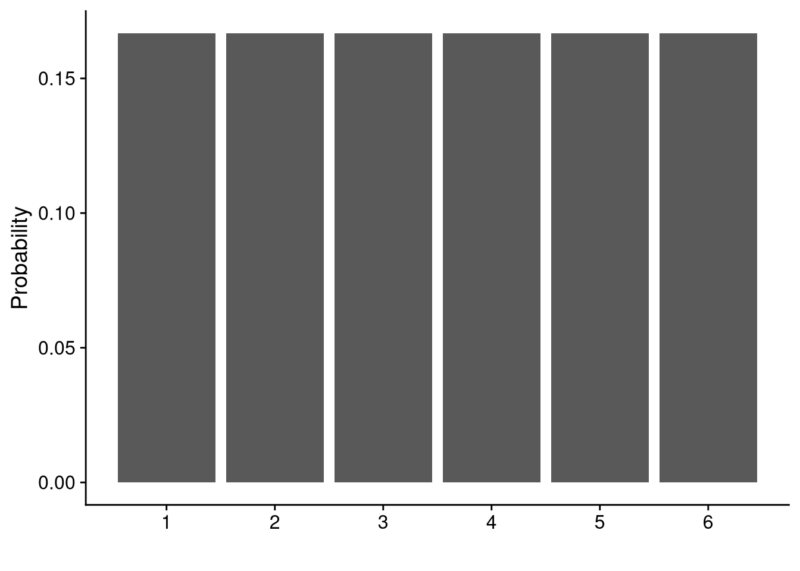
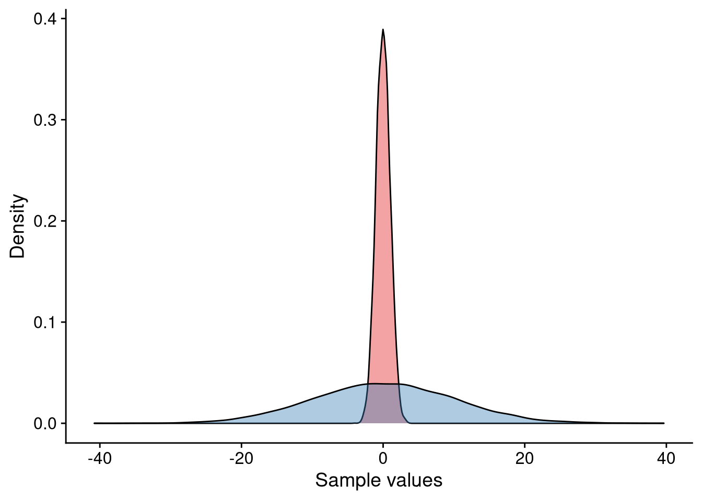
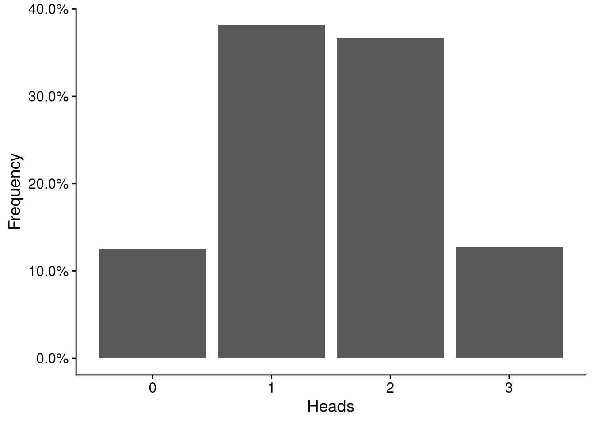
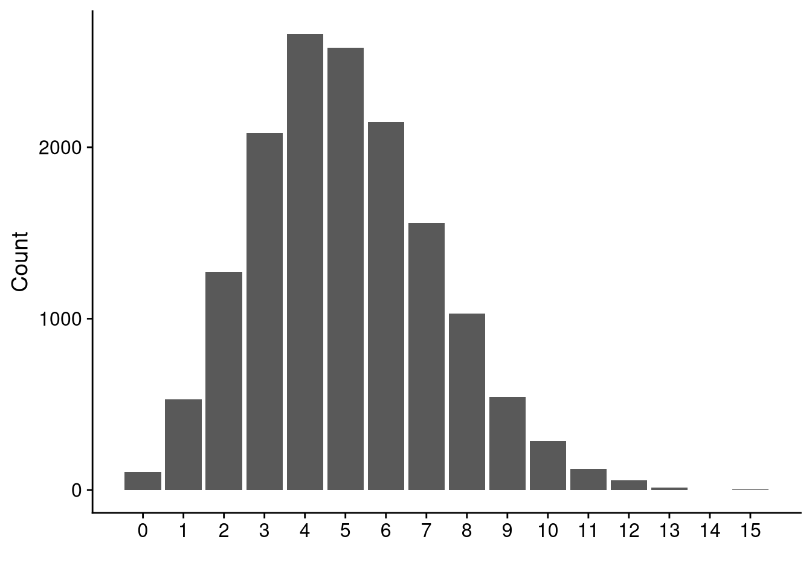
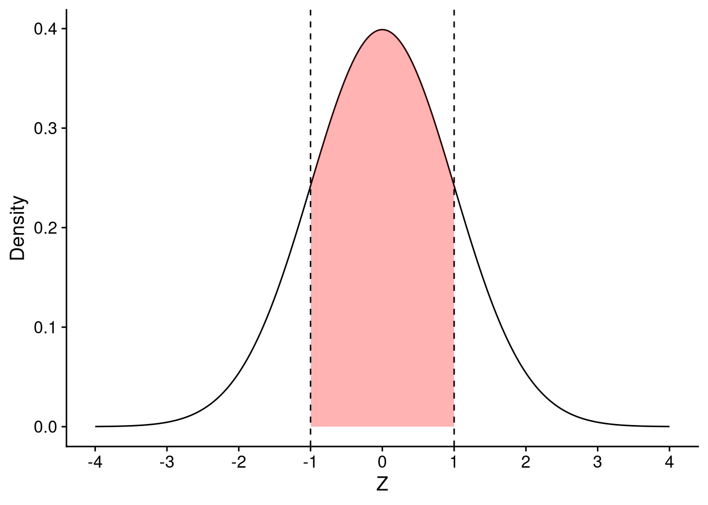
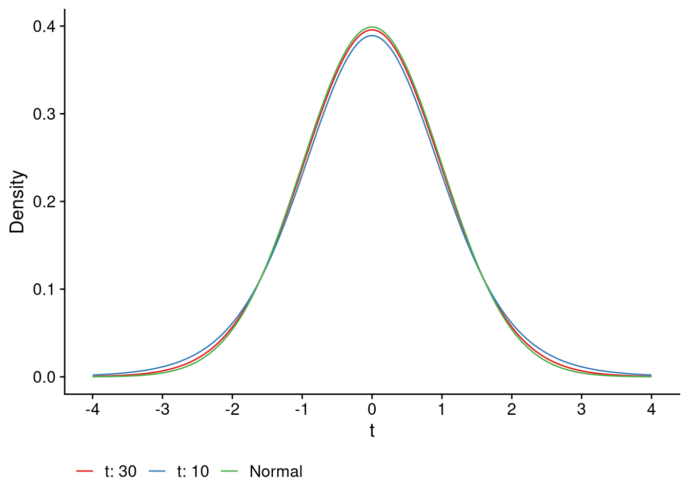
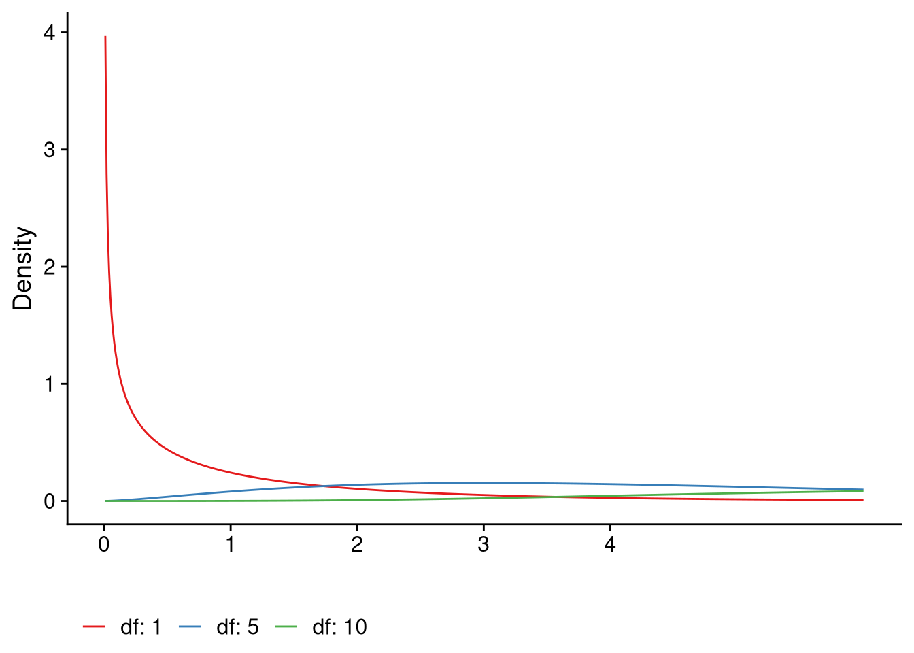
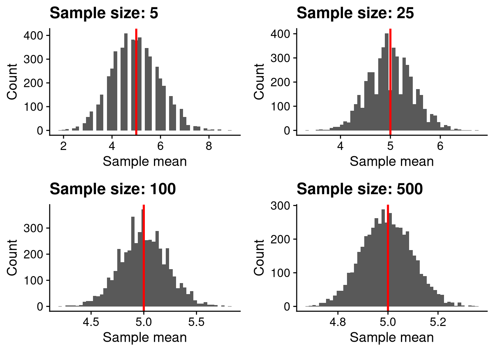

# Lecture 4: Probability theory


Statistics is based on probability theory. We must therefore learn a little about probability theory before we can learn about statistics. 

## The sample space
Imagine a simple experiment where we toss a coin once. The coin can come up as *heads* or *tails*. We therefore say that our experiment has two possible *outcomes*, viz. heads or tails. The collection (or set) of all possible outcomes of an experiment is called the *sample space*. For our coin experiment, the sample space is a collection (or set) with two *elements*, heads or tails. We can denote the sample space of the coin toss mathematically as:

$$
S = \{\mbox{Heads}, \mbox{Tails}\}.
$$

Another experiment is casting a die once. The die can come up as 1, 2, 3, 4, 5, or 6. The sample space $S$ can thus be written:

$$
S = \{1, 2, 3, 4, 5, 6\}.
$$

Here, $S$ has six elements. In both experiments, the sample space is *finite*. There are only a finite amount of possible outcomes.

### Discrete and continuous
In both experiments the sample space was *discrete*. It is discrete because we can "enumerate" all the options - give them indexes. For the coin experiment, the enumeration is as follows:

$$
\begin{array}{c}
\mbox{Index} & \mbox{Element} \\
1 & H \\
2 & T
\end{array}
$$

The die example is even simpler.

$$
\begin{array}{c}
\mbox{Index} & \mbox{Element} \\
1 & 1 \\
2 & 2 \\
3 & 3 \\
4 & 4 \\
5 & 5 \\
6 & 6
\end{array}
$$

That's not to say the discreteness implies *finiteness*. If we imagine a die with "infinite" faces we can still enumerate all the options. 

Now, imagine another experiment where we want measure the temperature in a glass of water that has been boiled. Before we measure the temperature at a given time the temperature can be anywhere between 20$^\circ$C and 100$^\circ$C. That is to say, $S = [20, 100]$. In this case we actually can't enumerate all the possible values which may seem counterintuitive. In this case, we say that the sample space is *continuous*; it exists in a *continuum* where we can *smoothly* go between values. 

If this feels fuzzy and unclear it is because it is. The continuity and the uncountability of real numbers are tough to grasp and required decades of mathematical work to be made rigorous.


## Random variables
We need some way to talk about the outcome of our experiment **before we perform it**. Let's us denote the outcome of the experiment **before we perform it** with $X$. We refer to $X$ as a *random variable*. To make things more conecrete let's return to the coin-tossing experiment. We can write: 

$$
X = \mbox{the outcome of our coin toss}.
$$

Thinking back to our sample space $S = \{H, T\}$ (H for Heads, T for Tails) we see that our random variable $X$ can take on two possible values: $X = H$ or $X = T$. We therefore say that our random variable $X$ is discrete. If $X$ could take on any value existing in a continuum, we would call $X$ a continuous random variable (think about the temperature experiment). 

## Probability of an outcome 
Having defined random variables and the values that they can take we are finally in the position to talk about the *probability* of a random variable $X$ taking the value $x$. Note the difference between upper-case $X$ and lower-case $x$. This distinction **is important**! $X$ is our **random variable** and $x$ is **what we observe**; $x$ **is not a random variable**. For the die-casting experiment $X$ is the outcome **before we toss the die**. After we toss the die, and let's assume it comes up as 6, then we say that $X = 6$. 

Now, how likely are we to see 6 as an outcome of our experiment? Assuming that our die is unbiased, we expect a 1-in-6 chance to observe 6. To understand why recall the sample space for this experiment. It was $S = \{1, 2, 3, 4, 5, 6\}$. There are six elements and we assume that any one of them is as likely to appear as the other. This can be written mathematicall as:

$$
P(X = x) = \frac16.
$$

The equation above can be parsed in English as follows: The probability ($P$) that our random varible $X$ takes on the value $x$ ($P(X = x)$) is one over six ($P(X = x) = 1/6$). Note that it doesn't matter what $x$ is; the probability is always $1/6$. 

This "equal spreading" of the probability is the naive definition of probability. We give each potential outcome equal weight. If $|S|$ is the number of elements in the sample space (6 for the die) then under equal probability we have that:

$$
P(X = x) = \frac{1}{|S|}
$$

Note that this becomes a problem as soon as we allow for infinite sample spaces. Thinking about the temperature example, the number of elements in the closed interval $[20, 100]$ is infinite, so the probability of picking a specific value $x$ at random is 0. At this level we therefore stick to two "rules":

1. If $X$ is discrete, we allow $P(X = x)$. 

2. If $X$ is continuous we need to consider an interval around $x$. That is, $P(a < X < b)$ which reads as "the probability that $X$ is between $a$ and $b$".

### The probability mass/density function
The probability mass function $f(x)$ gives us the probability that the discrete random variable$X$ takes the value $x$. We have already seen the explicit form of $f(x)$:

$$
f(x) = P(X = x).
$$

The probability mass function has two properties: $f(x) \geq 0$ and $\sum _{x \in S} f(x) = 1$. Here is a plot of the probability mass function of the die:



All the bars are of the same height because each outcome is just as likely. Here is a more involved example where the die is biased. We write:

$$
\begin{aligned}
&P(X = 1) = 1/10, \quad P(X = 2) = 2/10, \quad P(X = 3) = 3/10 \\ 
&P(X = 4) = 2/10, \quad P(X = 5) = 2/10, \quad P(X = 6) = 0/10
\end{aligned}
$$

As you can see, all probabilities are greater or equal to 0 and they add up to 1. Graphically, the probability mass function is:


The bars are no longer of equal of height as the probabilities are no longer equal.

When $X$ is a continuous random variable we speak of the probability *density* function.  

### The cumulative distribution function
The cumulative distribution function of a random variable $X$ is:

$$
F(x) = P(X \leq x).
$$

The above can be parsed as: what is the probability of our random variable $X$ taking any value less than or equal to $x$.

There exists a connection between the CDF and the density/mass functions. The mass function gives us the probability for a specific outcome but the CDF gives us the cumulative probability up to a specific event. Compare the graph of the CDF to the probability mass function graph for the example above.


For many continuous random variables there exists no explicit form of the CDF and we must thus rely on the density function.

## Properties of random variables

### Independence
We say that two random variables $X$ and $Y$ are independent of each other if the outcome of one random variable has no effect on the outcome of the other random variable. An example is tossing two coins. The outcome of one toss should have no influence on the outcome of the other toss.

If two random variables are not independent we say that they are dependent. 

### Identically distributed
Let $X_1, X_2, \ldots , X_n$ be a collection of random variables. We say that they are identically distributed if they have same probability distribution.


### Expected value
The expected value of a random variable $X$ is denoted with $E(X)$. You can think of it as the average of $X$. We calculate the expected value of $X$ by summing over the product of the potential outcomes of $X$ and the probability of the outcome. An example will make this clearer. Let's return to the die where $X$ is the outcome of the toss. Since each outcome is equally likely the expected value of $X$ is simply:

$$
\begin{aligned}
E(X) &= \sum _{x \in S} x P(X = x) \\
&= 1 \cdot P(X = 1) + 2 \cdot P(X = 2) + \ldots + 6 \cdot P(X = 6) \\
&= (1 + 2 + 3 + 4 + 5 + 6) \cdot \frac16 \\
&=3.5
\end{aligned}
$$

The expected value is a linear operator. Let $X$ and $Y$ be random variables and assume that $E(X) = \mu _X$ and $E(Y) = \mu _Y$. Then the expected value of $X$ **and** $Y$ is:
$$
E(X + Y) = E(X) + E(Y) = \mu _X + \mu _Y
$$

Furthermore, if $a$ is any constant then we have that 

$$
E(aX) = aE(X) = a\mu_X.
$$

There is a very important result about the expected value of a random variable $X$. It is called the **law of large numbers** and it states that as our sample of $X$ grows, the closer the mean of the sample is to the expected value of $X$. Let's toss a die a bunch of times and take the average of our throws. The plot below shows the average of our sample as a function of our sample size. The red line is the expected value of $X$ which we calculated to be 3.5. As you can see, the more often we throw the die, the closer our calculated sample mean is to the theoretical expected value. 


### Variance
The variance of a random variable $X$ tells us how "dispersed" our random variable is from its expected value and is denoted $Var(X)$. The higher the variance, the bigger the dispersion. Below is a plot of two samples with the same mean but a different variance.


The square root the variance is called the standard deviation which is often denoted with $\sigma$.

## Probability distributions
The probability distribution of a random variable $X$ completely describes the probabilities of the outcomes of $X$

## Examples of discrete distributions

### Bernoulli distribution
Imagine the coin-toss experiment. If the coin comes up as heads we will consider our experiment a success. We can encode the outcome of our experiment such that it takes on the value of 1 if it is a success (heads) and 0 otherwise. Our random variable $X$ is thus 1 if we get heads and 0 otherwise. The only thing missing is the probability of success (or by symmetry the probability of failure) which we will denote with $p$. If the coin is unbiased, $p$ is 0.5 as there is a 50/50 chance of success or failure.

When we can describe our experiment in such a way we say that $X$ is a Bernoulli random variable with success parameter $p$. Most experiments can be reduced to a Bernoulli trial. Let's take our die again. We will consider our experiment a success if we roll 6. As there is a 1/6 chance of rolling a 6, our success parameter $p$ is 1/6. Our experiment is a failure if we get any other outcome; that is if we get 1, 2, 3, 4, or 5. The probability of failure is thus 5/6. This is the general rule of thumb, the probability of failure is $1- p$.

The expected value of $X$ is $E(X) = p$ and the variance is $Var(X) = p(1-p)$. The probability mass function of $X$ is:

$$
f(x) = P(X = x) = p^x (1 - p)^{1 - x}
$$

### Binomial distribution
Let's say we toss the unbiased coin 3 times. We are then performing 3 Bernoulli trials, each with success parameter $p$. Once more we will consider an outcome of heads as a success. Here there are many possible permutations available:

$$
HHH, HHT, HTH, THH, HTT, THT, TTH, TTT.
$$

For our particular experiment we aren't interested in **when** we get heads but **how many** heads we get. Notice that we then have the following:

$$
\begin{array}{c}
\mbox{Number of heads} & \mbox{Outcomes} \\
0 & TTT \\
1 & HTT, THT, TTH\\
2 & HHT, HTH, THH\\
3 & HHH
\end{array}
$$
We see that outcomes with 0 and 3 heads are equally likely ($P(X = 0) = P(X = 3) = 1/8$), while $P(X = 1) = P(X = 2) = 3/8$. Here we can define the random variable $X$ as the number of heads and we say that it is binomially distributed with parameters $n$ and $p$. $n$ is the number of Bernoulli trials (number of coin flips, die throws) and $p$ is the success probability. The expected value of $X$ is $E(X) = np$ and the variance of $X$ is $Var(X) = np(1-p)$. The probability mass function is:

$$
f(x) = P(X = x) = \binom{n}{k} p^k (1-p)^{n - k},
$$

where $k$ is the number of successes. Note the similarity with the Bernoulli distribution.

Let's simulate the scenario above. We will toss a coin three times for 10000 iterations and for each iteration keep track the number of heads. You can see the result in the plot below.



We can compute probabilities such as $P(X = x)$ and $P(X <= x)$ with the `dbinom()` and `pbinom()` functions.


```r
# P(X = 2)
dbinom(x = 2, size = 3, prob = 0.5)
#> [1] 0.375
# P(X <= 2)
pbinom(q = 2, size = 3, prob = 0.5)
#> [1] 0.875
```

### Poisson distribution
The third discrete distribution is the Poisson distribution. We use the binomial distribution to model counts within some interval. Unlike the binomial distribution which has a fixed upper bound $n$ the Poisson distribution has no ceiling. The Poisson distribution has a single parameter $\lambda$ which describes the expected number of outcomes within the interval. The defining characteristic of the Poisson distribution is that its expected value is equal to its variance. That is: $E(X) = \lambda = Var(X)$.

Below is a plot of 10000 draws from the Poisson distribution with rate parameter $\lambda = 5$.




We can compute probabilities such as $P(X = x)$ and $P(X <= x)$ with the `dpois()` and `ppois()` functions.


```r
# P(X = 5)
dpois(x = 5, lambda = 5)
#> [1] 0.1754674
# P(X <= 5)
ppois(q = 5, lambda = 5)
#> [1] 0.6159607
```

## Examples of continuous distributions

### The normal distribution
The normal distribution is the most important probability distribution you will see in this course. Many continuous variables can be described with the normal distribution. The normal distribution is completely described by the expected value and variance (standard deviation). That means that if we know the expected value and the variance we can completely reconstruct the distribution. Another property of the normal distribution is symmetry. If a normal distribution has expected value $\mu$ and standard deviation $\sigma$, roughly 68%, 95%, and 99.7% of all measurements are within one, two, and three standard deviations respectively.

Let's look at the density of a normally distributed random variable $Z$ with expected value 0 and standard deviation 1.


A normal distribution doesn't have to have expected value 0 and standard deviation 1 but when it does we refer to it as the *standard normal distribution*. Any normal distribution can be transformed into the standard normal distribution by *centering* and scaling the random variable. For example: imagine that $X$ is a normally distributed random variable with parameters $\mu = 10$ and $\sigma = 5$. The density looks like:


If we center $X$ by subtracting the expected value, and scale $X$ by dividing with the standard deviation:

$$
Z = \frac{X - \mu}{\sigma} = \frac{X - 10}{5},
$$

we see that $Z$ is a normally distributed random variable with expected value 0 and standard deviation 1.

Compared to the probability mass function we have spent little time discussing the probability density function. The probability density function is a little trickier to use as it relies on calculus. Say we have $Z$, a random variable from the standard normal distribution, and we want to know the probability that $Z$ is between -1, and 1, or $P(-1 \leq Z \leq 1)$. When we were working with the probability mass function it was enough for us to add up the probabilities for the respected values. But since $Z$ is continuous, the probability of $Z$ taking any specific value is 0. We must thus look at intervals. To compute the probability that a random variable is within that region requires integration, something we won't cover in this course.


The area of the red, shaded area is approximately 0.6826895, so:

$$
P(-1 \leq Z \leq 1) \approx 68\%.
$$

We can calculate other probabilities such as $P(Z > 2)$ and $P(Z < -0.5)$. For $P(Z > 2)$ we can use the fact that probabilities must add up to 1 so we can rewrite $P(Z > 2) = 1 - P(Z <= 2)$.


We can use R to calculate the area of the red curves. To do so we must use the `pnorm()` function. Let's compute the probabilities of all three cases:


```r
pnorm(q = -0.5, mean = 0, sd = 1)
#> [1] 0.3085375
1 - pnorm(q = 2, mean = 0, sd = 1)
#> [1] 0.02275013
pnorm(q = 1, mean = 0, sd = 1) - pnorm(q = -1, mean = 0, sd = 1)
#> [1] 0.6826895
```


### The $t$-distribution
Closely related to the normal distribution is the $t$-distribution. It is reminiscent of the normal distribution but it has "heavier tails". The number of degrees of freedom determine the shape of the distribution. We will discuss the $t$-distribution better later.



We can compute probabilities $P(X < x)$, where $X$ is a random variable with the $t$-distribution, with the `pt()` function. The `pt()` function requires two inputs, $x$ and the number of degrees of freedom:


```r
1 - pt(q = 2, df = 5)
#> [1] 0.05096974
```

Compare this value to when we computed `pnorm(q = 1, mean = 0, sd = 1)`. It is greater for the $t$-distribution which is a consequence of its heavier tails.

### The $\chi ^2$ distribution
The $\chi ^2$ distribution is based on the normal distribution. It is not symmetrical and like the $t$-distribution it has a single parameter, namely the number of degrees of freedom. 



We can compute probabilities $P(X < x)$, where $X$ is a random variable with the $\chi^2$-distribution, with the `pchisq()` function. The `pchisq()` function requires two inputs, $x$ and the number of degrees of freedom:


```r
1 - pchisq(q = 2, df = 1)
#> [1] 0.1572992
```

## The central limit theorem
A very important result from probability theory is the **Central limit theorem**.  It says that the mean of a sample will resemble the normal distribution more closely as the sample grows. Furthermore, the variance decreases as the sample size increases.

Remember the Poisson distribution from before? 


Let's draw random samples from our Poisson distribution above. Our samples will be of size 5, 25, 100, 500. For each sample we will compute the mean and store it. After repeating this process 5000 times, we will plot the results:



