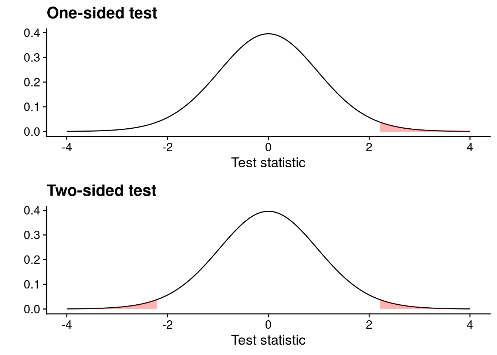
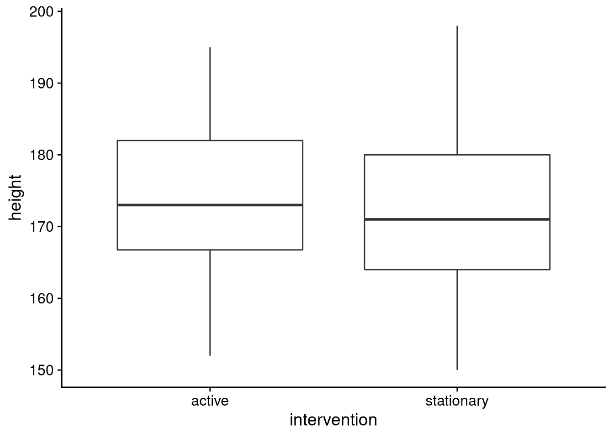

# Lecture 5: Inference
So far we have been doing descriptive statistics. We have computed stuff like means, standard deviations and so on. The purpose of descriptive statistics is to allow us get a feel for the data and explore whether our research question can be answered by the data. Once we have done the descriptives, we must confirm them with statistical tests. Eyeballing is not enough. The goal of this lecture is to give you the tools necessary to answer simple research questions with statistics.


## The population and the sample
I've made some cryptic references to "populations" and "samples". The *population* is the group we are interested in investigating **in its entirety**. If the study is about the average height of Europeans then the population is the entire population of Europe. Obviously it is impossible to measure every single individual in Europe so instead we have to make to with a *sample*; a randomly selected subgroup of the population. We examine our sample to make inferences about the population.

Note that population is unique but we can have many samples from the same population.

## Sample statistics
We are interested in *statistics*. A statistic is any function of the sample. For example, assume that we measure the height of ten individuals and we then compute the mean of those measurements. Here, the mean is our *statistic* because it is a function of the data (the measurements). Since the mean is a function of the sample, and the sample is random, then the mean inherits this property and **is itself stochastic**. Be careful! Once we have taken the measurements they are deterministic and **not** stochastic. 

Let's create an example to illustrate this property. We will create a "fake" population and then we will repeatedly sample it and compute the mean of the sample.


```r
# The population
population <- c(181, 191, 171, 151, 161, 171, 172, 
                175, 165, 183, 201, 151, 159, 153, 165)
# Let's draw 5 samples from the population, each of size 4 
# and compute the mean. 
set.seed(7783)
means <- colMeans(replicate(5, sample(population, size = 4)))
# Make output more readable
names(means) <- c('mean1', 'mean2', 'mean3', 'mean4', 'mean5')
means
#>  mean1  mean2  mean3  mean4  mean5 
#> 167.25 178.00 159.50 174.50 183.75
```
As you can see, each of our samples gave a different mean.

## Properties of the mean of the sample
Let us denote the mean of the sample **before we observe the sample** with $\bar{X}$ and the mean of the **observed sample** with $\bar{x}$. Here $\bar{X}$ is a random variable and $\bar{x}$ is its outcome. Since $\bar{X}$ is a random variable it has distributional properties: it has an expected value and variance.

If $X_1, X_2, \ldots , X_n$ are independent and identically distributed variables, each with the same expected value $E(X_i) = \mu$ and the same variance $Var(X_i) = \sigma ^2$ then:

$$
E(\bar{X}) = \mu, \quad Var(\bar{X}) = \frac{\sigma ^2}{n}.
$$

You may have heard about the standard error before. The standard error is simply the standard deviation of our random variable $\bar{X}$; namely, $SE(\bar{X}) = \sigma/\sqrt{n}$. It gets its own name because it is so commonly used.

Finally, if we assume that our sample $X_1, X_,2, \ldots , X_n$ comes from the normal distribution with parameters $\mu$ and $\sigma$ then $\bar{X}$ is also normally distributed with parameters $\mu$ and $\sigma / \sqrt{n}$. 

Let's create an example like we did before. We will draw a sample of size 25 from a standard normal distribution 5000 times. We will then compute the mean of each sample and store it. After the simulation has run its course, we will compute the mean and standard deviation of the 5000 means and then finally plot them. We expect the sample mean to 0, the standard deviation to be $1/\sqrt{25}$. Finally, we expect the histogram of the means to resemble the normal distribution. 


```r
nMeans <- colMeans(replicate(5000, rnorm(n = 25, mean = 0, sd = 1))) 
tibble(parameter = c('mean', 'standard deviation'),
       theoretical = c(0, 1/sqrt(25)), 
       simulation = c(mean(nMeans), sd(nMeans))) %>%
    kbl() %>%
    kable_styling(full_width = F)
```

<table class="table" style="width: auto !important; margin-left: auto; margin-right: auto;">
 <thead>
  <tr>
   <th style="text-align:left;"> parameter </th>
   <th style="text-align:right;"> theoretical </th>
   <th style="text-align:right;"> simulation </th>
  </tr>
 </thead>
<tbody>
  <tr>
   <td style="text-align:left;"> mean </td>
   <td style="text-align:right;"> 0.0 </td>
   <td style="text-align:right;"> 0.0020905 </td>
  </tr>
  <tr>
   <td style="text-align:left;"> standard deviation </td>
   <td style="text-align:right;"> 0.2 </td>
   <td style="text-align:right;"> 0.1967958 </td>
  </tr>
</tbody>
</table>


```r
tibble(means = nMeans) %>%
    ggplot(aes(x = means)) +
    geom_histogram() +
    theme_cowplot()
#> `stat_bin()` using `bins = 30`. Pick better value with
#> `binwidth`.
```


## The estimator
An estimator is a statistic that estimates the parameters of a model. We have already seen a few parameters before such as the success probability $p$ of the binomial distribution and $\mu$ and $\sigma$ of the normal distribution. 

### Proportions and means
The same estimator works for $\mu$ and $p$:

$$
\hat{\mu} = \frac{\sum _ {i = 1} ^n X_ i}{n} = \hat{p}
$$

Here is an example for the binomial distribution. Imagine a population of 50 people. Each person can be diabetic or not. It is in our interest to determine the proportion of people who are diabetic. Unfortunately we could only secure enough grant money to test 20 people.


```r
set.seed(847)
diabetesPref <- rbinom(n = 50, size = 1, prob = 0.3)
# This is the true population
diabetesPref
#>  [1] 1 1 1 0 0 0 0 0 0 0 0 1 1 0 0 1 0 1 0 0 0 0 1 1 1 1 0 0
#> [29] 1 0 0 0 1 0 0 0 1 1 0 0 0 0 0 1 0 0 0 0 0 0
# Sample 20 people
sampleDia <- sample(diabetesPref, size = 20)
mean(sampleDia)
#> [1] 0.25
```
As you can see, the estimate of $p$ was 0.25 which is pretty close to the population proportion.

### Variance
We denote the estimator of the variance with $S^2$. It is defined as:

$$
S^2 = \frac{\sum _ {i = 1} ^n (X_i - \bar{X})^2}{n - 1}.
$$

Once we have seen the data we denote the *estimate* with $s^2$. If we wanted the estimate of the standard deviation we simply take the square root of $s^2$.

## Confidence intervals
So far we have only considered point estimates. As you saw in the mean example, our point estimates were dependent on our sample. The probability of our point estimator being exactly equal to the parameter we are trying to estimate is 0 (remember our discussion about continuous random variables). We also saw that as we increased the sample size, or we were allowed to repeat our sampling, we approached the true parameter value. Now, both of these are impossible in real life. Our sample size is often restricted due to external factors (often many) and we can't easily repeat experiments.

Luckily, there is a solution to this problem: confidence intervals. We construct confidence interval around our point estimates to get a sense of what other estimates are likely. The wider our confidence intervals, the more likely we are to catch the true parameter. You have probably seen terms like 95% confidence interval or 99.5% confidence interval. These percentages reflect the proportion of times that the true parameter value is contained in the interval **IF** we could repeat the experiment infinitely often. If this sounds weird, that's because it is. Please note the parameter **never changes**, only our estimates.    

More generally we speak of a $1 - \alpha$ confidence interval where $\alpha$ is our accepted type I error probability. For example, if we are interested in the 95% confidence interval, we accept the type I error probability to 5% and $alpha = 0.05$. 

What is the type I error probability? In this instance it is the proportion if confidence intervals we construct around our point estimates that don't contain the true parameter value.

To create confidence intervals we need to compute *test statistics*. More on those later.

## Hypothesis tests
An alternative to confidence intervals are hypothesis tests. A hypothesis test has two components: the null hypothesis $H_0$ and the alternative hypothesis $H_1$. The null hypothesis is often some bland, boring scenario we want to reject. For example, if we two groups, one on a placebo and the other on the actual drug, the null hypothesis could be that there is no difference between the groups. This is obviously a very boring result from the perspective of the pharmaceutical company which wants to demonstrate the efficacy of its drug. The alternative hypothesis is then the scenario we are interested in i.e. there is a difference between the groups.

So how do we go about this? After we have defined our hypothesis test we assume that the null hypothesis is true. We then use our data to construct a *test* statistic to *test* the null hypothesis. Often the test statistic will have a well known probability distribution; if the test statistic is "unlikely enough" given the null hypothesis, we use that as evidence to reject the null hypothesis.

Important: **we never accept the null hypothesis**. 

### The orientation of the hypothesis test
Our hypothesis test can be one-sided or two-sided. An example of a one-sided test is: 

$$
\begin{aligned}
H_0&: \mbox{the mean cholesterol of group A equal to the mean of group B} \\
H_1&: \mbox{the mean cholesterol of group A is smaller than the mean of group B}
\end{aligned}
$$

An example of a two-sided test is:

$$
\begin{aligned}
H_0&: \mbox{the mean cholesterol of group A equal to the mean of group B} \\
H_1&: \mbox{the mean cholesterol of group A is not equal than the mean of group B}
\end{aligned}
$$

### The test statistic of the hypothesis test
A test statistic is a statistic which we can use to reject the null hypothesis. An example of a test statistic is:

$$
t = \frac{\bar{X} - \mu}{S/\sqrt{n}} 
$$

which we will use to perform $t$-tests. Note that the test statistic is based on the sample and is thus a random variable with a distribution. We will compare the computed test statistic to the theoretical distribution (under the null). 

It's important to know which test statistic to compute. If we are looking at means and we assume the normal distribution, the appropriate test is the $t$-test. We need the $t$-test because we don't know the standard deviation of the population distribution.

### The rejection region
As we said before, we reject the null if our test statistic is unreasonable given the null hypothesis. The rejection region is the area of the distribution of the test statistic which contains all the values which will lead to a rejection of the null hypothesis. The rejection region is always at the tails of the distribution.



If our computed test statistic is in the red region we reject the null. Otherwise, we cannot reject the null.

### The $p$-value
Assume $t$ is some test statistic. The $p$-value of a hypothesis test is the probability of seeing a larger test statistic than $t$ given that the null hypothesis is true. If the $p$-value is smaller than some **predefined** significance threshold $\alpha$ we use that as evidence to support the decision to reject the null hypothesis.

### Power and errors
The *power* of a test is the probability of rejecting a null hypothesis that should be rejected. We can increase statistical power by increasing our sample size. 

We commit a type I error when we reject a null hypothesis when we shouldn't (false positive). Similarly, we commit a type II error when we *do not* reject a null hypothesis when we should (false negative).

## Examples
We will use the `pulseEn.csv` data.


```r
pulse <- 
    read_csv2('https://notendur.hi.is/thj73/data/pulseEn.csv') %>%
    na.omit() %>% # Remove NA
    filter(height < 300) # Remove two weird height values
```

### The simple $t$-test
Let's see if the average height of `pulseEn` differs from 150 cm significantly. To do so we use the `t.test()` function. The parameter value of `mu` is 0 by default so we need to change it to the value we want to test.


```r
t.test(pulse$height, mu = 150)
#> 
#> 	One Sample t-test
#> 
#> data:  pulse$height
#> t = 48.684, df = 423, p-value < 2.2e-16
#> alternative hypothesis: true mean is not equal to 150
#> 95 percent confidence interval:
#>  172.3950 174.2795
#> sample estimates:
#> mean of x 
#>  173.3373
```

The $p$-value is tiny. We strongly reject the null hypothesis.

The test statistic of this test can be computed as:

$$
t = \frac{\bar{x} - \mu _ 0}{s/\sqrt{n}}
$$

### A small $t$-test app

[Click me!](https://qx6oyz-0rarinn-j0nmundsson.shinyapps.io/ttest/)


### The $t$-test for groups
Our variable of interest is the height of our sample. Our hypothesis test is as follows:

$$
\begin{aligned}
H_0:& \mbox{The mean height of the intervention groups is the same} \\
H_1:& \mbox{The mean height of the intervention groups is not the same}
\end{aligned}
$$

We begin by inspecting the variables graphically:


```r
pulse %>%
    ggplot(aes(x = intervention, y = height)) +
    geom_boxplot() +
    theme_cowplot()
```



As we can see the difference between the groups is little, at least height-wise. This makes us suspect that we will be unable to reject the null hypothesis that the mean height of the groups is different. Let's confirm this by performing a $t$-test with the `t.test()` function:


```r
t.test(height ~ intervention, data = pulse)
#> 
#> 	Welch Two Sample t-test
#> 
#> data:  height by intervention
#> t = 1.7387, df = 365.06, p-value = 0.08292
#> alternative hypothesis: true difference in means between group active and group stationary is not equal to 0
#> 95 percent confidence interval:
#>  -0.221251  3.599599
#> sample estimates:
#>     mean in group active mean in group stationary 
#>                 174.3571                 172.6680
```

We see that the $p$-value of the test is 0.0829235 so we are unable to reject the null hypothesis at significance level of $\alpha = 0.05$. Note that we also get the confidence interval. 

The test statistic can be computed as:

$$
t = \frac{(\bar{x} - \bar{y} - \delta _ 0)}{\sqrt{s_1^2/n + s_2^2/n}}
$$

### The paired $t$-test
Let us see if there is a difference between the first and second pulse measurement for the control group. As the control group did nothing between measurements, we expect there to be significant difference between the measurements. As always, we begin by plotting the two measurements:


```r
pulse %>%
    filter(intervention == 'stationary') %>%
    gather(measurement, value, firstPulse, secondPulse) %>% # convert to long
    ggplot(aes(x = measurement, y = value)) +
        geom_boxplot() +
        theme_cowplot()
```


The two distributions seem identical. Let's perform the paired $t$-test


```r
stationary <- 
    pulse %>%
    filter(intervention == 'stationary')
t.test(stationary$firstPulse, stationary$secondPulse)
#> 
#> 	Welch Two Sample t-test
#> 
#> data:  stationary$firstPulse and stationary$secondPulse
#> t = -0.076792, df = 506.37, p-value = 0.9388
#> alternative hypothesis: true difference in means is not equal to 0
#> 95 percent confidence interval:
#>  -2.076885  1.920635
#> sample estimates:
#> mean of x mean of y 
#>  71.04297  71.12109
```

This time the $p$-value is quite large and we completely fail to reject the null hypothesis.

The test statistic can be computed as:

$$
t = \frac{\bar{w} - \Delta _ 0}{s_w /\sqrt{n}}
$$

where

$$
\begin{aligned}
\bar{w} &= \frac1n \sum _ {i = 1} ^n w_i, \\
w_i &= x_i - y_i, \\ 
s_w &= \sqrt{\frac{1}{n - 1} \sum _ {i = 1} ^n (w_i - \bar{w})}
\end{aligned}
$$

### A test for proportions
Let's see if there is a difference proportion of smokers versus non-smokers. We begin by constructing a table to see how many fall in each category.


```r
prop.table(table(pulse$smokes))
#> 
#>        no       yes 
#> 0.9009434 0.0990566
```
Using the table above we see that almost no one smokes in our sample. Let's perform the test:


```r
binom.test(table(pulse$smokes))
#> 
#> 	Exact binomial test
#> 
#> data:  table(pulse$smokes)
#> number of successes = 382, number of trials = 424,
#> p-value < 2.2e-16
#> alternative hypothesis: true probability of success is not equal to 0.5
#> 95 percent confidence interval:
#>  0.8684666 0.9276729
#> sample estimates:
#> probability of success 
#>              0.9009434
```

The test statistic can be computed as:

$$
z = \frac{\hat{p} - p_0}{\sqrt{p_0(1 - p_0)/n}}
$$

where $\hat{p} = x/n$, and $x$ is the number of successes.

## In conclusion
There are other tests we can perform such as tests for independence in a contingency table or tests for variances but we will talk about them when we discuss ANOVA. Also, today's lecture has been heavy on the hypothesis tests without any mention of confidence intervals. We will discuss confidence intervals better when we talk about linear models.
