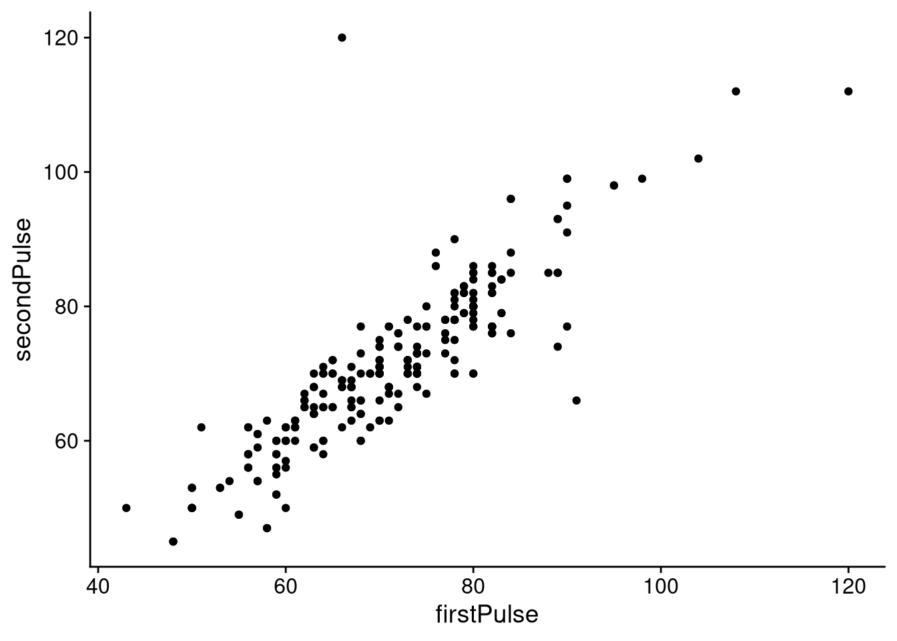
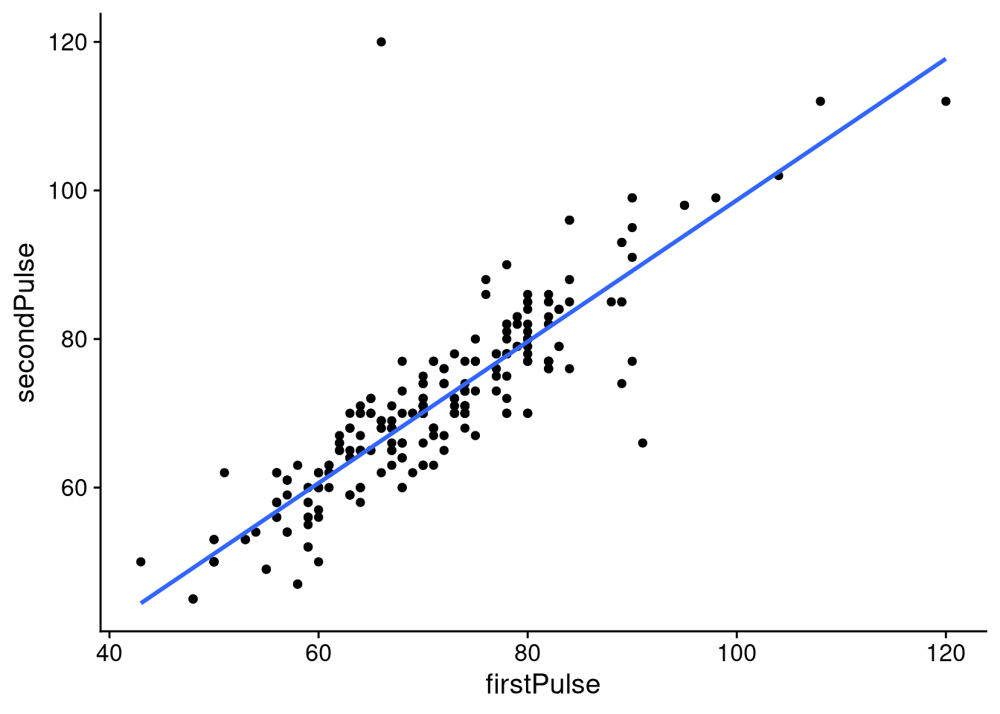

# Lecture 7: Simple linear regression

```r
library(tidyverse)
library(cowplot)
library(knitr)
library(kableExtra)
```

## The model
When we are working with a simple linear regression model we have the *dependent* variable $Y$, the *independent* variable $x$, and the *error* $\varepsilon$. The error $\varepsilon$ is stochastic and we assume that it comes from a normal distribution with parameters $\mu = 0$ and $\sigma ^2$, where $\sigma ^2$ is unknown.  We can also write this as $\varepsilon \sim N(0, \sigma ^2)$. 
We assume the following relationship between the variables:

$$
Y = \beta _ 0 + \beta _ 1 x + \varepsilon 
$$

We call this model the *simple* linear regression model because we only have one independent variable. The goal of linear regression is to estimate *parameters* $\beta _ 0$, $\beta _ 1$, and $\sigma$. Sometimes I will refer to $\beta _ 0$ as the *intercept* and $\beta_1$ as the *slope*. When we have *measured* $Y$ we denote it with $y$. Note: $Y$ **is a random variable** and $y$ is the *observed* value of $Y$. Since $\varepsilon$ is normally distributed then so is $Y$. In fact, we have that $Y \sim (\beta _ 0 + \beta _ 1 x, \sigma ^2)$.

## Interlude: pulse data
Let's load in the `pulse` data again and filter it so that we only have observations from the stationary group.


```r
pulse <- read_csv2('https://notendur.hi.is/thj73/data/pulseEn.csv') %>%
    filter(intervention == 'stationary') %>%
    na.omit()
```

Let's plot the first pulse measurement agains the second pulse measurement.


```r
pulse %>%
    ggplot(aes(x = firstPulse, y = secondPulse)) +
    geom_point() +
    theme_cowplot()
```



As you guys can see there seems to exists a *linear* relationship between the two variables. **The goal of linear regression is to find the best line through these points**. Unfortunately, we can draw infinite lines in the plane.


```r
pulse %>%
    ggplot(aes(x = firstPulse, y = secondPulse)) +
    geom_point() +
    geom_abline(slope = 0, intercept = 70, lty = 2) + 
    geom_abline(slope = 1, intercept = 4, lty = 3) +
    geom_abline(slope = 1.2, intercept = -4, lty = 4) +
    geom_abline(slope = 1.4, intercept = -20, lty = 5) +
    geom_abline(slope = 1.6, intercept = -40, lty = 6) +
    geom_abline(slope = 1, intercept = 3, col = 'red') +
    geom_abline(slope = 1, intercept = 6, col = 'blue') + 
    theme_cowplot()
```


To find the "best" line we need to come up with some measure we can use to *compare* the lines. 

## The least squares method
If we had complete information we could find the best line easily. Consider the following line:
$$
y = 1 + 2x
$$
We can completely reconstruct the line above from two measurements. As there is a random element in our model ($\varepsilon$) our measurements are "corrupted" and we need to "guess". Here is an example of a "guess":

$$
\tilde{y} = \tilde{\beta} _ 0 + \tilde{\beta} _ 1 x.
$$

Here $\tilde{\beta} _ 0$ and $\tilde{\beta} _ 1$ are our "guesses". Luckily, we don't have to guess randomly as there exists a closed-form solution to the problem. It turns out that the *best* combination of $\tilde{\beta} _ 0$ and $\tilde{\beta} _ 1$ is the combination that **minimizes** the following expression:

$$
\begin{aligned}
\sum _ {i = 1}^n (y_ i -(\tilde{\beta} _ 0 + \tilde{\beta} _ 1x_i))^2 & = \sum _ {i = 1} ^n (y_i - \tilde{y}_ i)^2 \\
&= \sum _ {i = 1}^n e_i ^2.
\end{aligned}
$$

We are trying to *minimize* the *square sum* above. This is where the method gets its name; this is the measure we were looking for. 

The quantity $e_i$ is called the $i$-th *residual* and it quantifies how much our guess diverges from our observed value. Once the best guesses of $\beta _ 0$ and $\beta _ 1$ have been found it is customary to denote them as $\hat{\beta} _ 0$ and $\hat{\beta} _ 1$. 

## Finding the best line in R
We can use the `lm()` function in R to fit a linear model to our pulse data. 


```r
linearModel <- lm(secondPulse ~ firstPulse, data = pulse)
```

To see the results of our model we use the `summary()` function:


```r
summary(linearModel)
#> 
#> Call:
#> lm(formula = secondPulse ~ firstPulse, data = pulse)
#> 
#> Residuals:
#>     Min      1Q  Median      3Q     Max 
#> -24.123  -3.082   0.301   2.582  53.678 
#> 
#> Coefficients:
#>             Estimate Std. Error t value Pr(>|t|)    
#> (Intercept)    3.487      2.371   1.471    0.143    
#> firstPulse     0.952      0.033  28.852   <2e-16 ***
#> ---
#> Signif. codes:  
#> 0 '***' 0.001 '**' 0.01 '*' 0.05 '.' 0.1 ' ' 1
#> 
#> Residual standard error: 5.809 on 255 degrees of freedom
#> Multiple R-squared:  0.7655,	Adjusted R-squared:  0.7646 
#> F-statistic: 832.4 on 1 and 255 DF,  p-value: < 2.2e-16
```

There is a lot to unpack here but for now concentrate on the "Coefficients" part of the output. 


```r
broom::tidy(linearModel) %>%
    kbl(booktabs = T) %>%
    kable_styling(full_width = F)
```

<table class="table" style="width: auto !important; margin-left: auto; margin-right: auto;">
 <thead>
  <tr>
   <th style="text-align:left;"> term </th>
   <th style="text-align:right;"> estimate </th>
   <th style="text-align:right;"> std.error </th>
   <th style="text-align:right;"> statistic </th>
   <th style="text-align:right;"> p.value </th>
  </tr>
 </thead>
<tbody>
  <tr>
   <td style="text-align:left;"> (Intercept) </td>
   <td style="text-align:right;"> 3.4874648 </td>
   <td style="text-align:right;"> 2.3710335 </td>
   <td style="text-align:right;"> 1.470863 </td>
   <td style="text-align:right;"> 0.1425611 </td>
  </tr>
  <tr>
   <td style="text-align:left;"> firstPulse </td>
   <td style="text-align:right;"> 0.9520395 </td>
   <td style="text-align:right;"> 0.0329972 </td>
   <td style="text-align:right;"> 28.852160 </td>
   <td style="text-align:right;"> 0.0000000 </td>
  </tr>
</tbody>
</table>
From the output we see that $\hat{\beta} _ 0$ is 3.487 and $\hat{\beta} _ 1$ is 0.952. Let's plot the best line over our measurements.


```r
pulse %>%
    ggplot(aes(x = firstPulse, y = secondPulse)) +
    geom_point() +
    stat_smooth(method = 'lm', se = F) +
    theme_cowplot()
```



## Hypothesis tests
Each estimate has its standard error, $t$-statistic and $p$-value. The hypothesis test is:

$$
\begin{aligned}
H_0&: \mbox{ parameter } \beta _ i = 0 \\
H_1&: \mbox{ parameter } \beta _ i \neq 0
\end{aligned}
$$

The test statistic of the hypothesis is:
$$
t = \frac{\hat{\beta} _ i}{se(\hat{\beta} _ i)}
$$

Looking at the $p$-value column we can see that we can comfortably reject the null hypothesis ($\alpha = 0.05$) for the slope, but not the intercept. We can get the confidence intervals for our parameters using the `conf.int()` function:


```r
confint(linearModel, level = 0.95)
#>                  2.5 %   97.5 %
#> (Intercept) -1.1818366 8.156766
#> firstPulse   0.8870579 1.017021
```

Sometimes we want to plot our coefficients with their confidence intervals. This can done quite easily with the `conf.int` option of the `tidy()` function from the package `broom`.


```r
broom::tidy(linearModel, conf.int = T) %>%
    ggplot(aes(x = estimate, y = term)) +
    geom_errorbarh(aes(xmin = conf.low, xmax = conf.high), height = 0) +
    geom_point(col = 'red', size = 2) +
    theme_cowplot() 
```


## What about $\sigma ^2$?
We denote the estimate of $\sigma ^2$ with $\hat{\sigma}^2$ and define it as:
$$
\hat{\sigma}^2 = \frac{1}{n - k}\sum _ {i = 1} ^n (y_i - \hat{y}_ i)^2,
$$
where $k$ is the number of parameters in our model (excluding $\sigma ^2$). The estimate $\hat{\sigma}$ can be seen in the output of the `summary()` function. Alternatively we can use the `glance()` function from the `broom` package.


```r
broom::glance(linearModel) %>%
    kbl(booktabs = T) %>%
    kable_styling(full_width = F)
```

<table class="table" style="width: auto !important; margin-left: auto; margin-right: auto;">
 <thead>
  <tr>
   <th style="text-align:right;"> r.squared </th>
   <th style="text-align:right;"> adj.r.squared </th>
   <th style="text-align:right;"> sigma </th>
   <th style="text-align:right;"> statistic </th>
   <th style="text-align:right;"> p.value </th>
   <th style="text-align:right;"> df </th>
   <th style="text-align:right;"> logLik </th>
   <th style="text-align:right;"> AIC </th>
   <th style="text-align:right;"> BIC </th>
   <th style="text-align:right;"> deviance </th>
   <th style="text-align:right;"> df.residual </th>
   <th style="text-align:right;"> nobs </th>
  </tr>
 </thead>
<tbody>
  <tr>
   <td style="text-align:right;"> 0.7655058 </td>
   <td style="text-align:right;"> 0.7645863 </td>
   <td style="text-align:right;"> 5.808717 </td>
   <td style="text-align:right;"> 832.4471 </td>
   <td style="text-align:right;"> 0 </td>
   <td style="text-align:right;"> 1 </td>
   <td style="text-align:right;"> -815.8187 </td>
   <td style="text-align:right;"> 1637.637 </td>
   <td style="text-align:right;"> 1648.285 </td>
   <td style="text-align:right;"> 8604.003 </td>
   <td style="text-align:right;"> 255 </td>
   <td style="text-align:right;"> 257 </td>
  </tr>
</tbody>
</table>

We see that $\hat{\sigma}$ is roughly 5.8087.

## The coefficient of determination $R^2$
One way to evaluate the goodness of our fit is to compute the coefficient of determination $R^2$:

$$
R^2 = 1 - \frac{\sum _ {i = 1} ^n (y_i - \hat{y}_ i)^2}{\sum _ {i = 1} ^n (y_i - \bar{y}_ i)^2}
$$

The denominator of $R^2$ is the *variation in the data* while the numerator is the sum squares of our residuals. The value of $R^2$ represents the amount of variation in the data explained by the model. For our model, the $R^2$ value is 0.7655. That is, our model explains 76.5% of the variation in the data. That's pretty decent.

When we have a simple linear regression model the coefficient of correlation $r$ and the coefficient of determination $R^2$ are related. We can compute the correlation between two variables with the `cor()` function.


```r
cor(pulse$firstPulse, pulse$secondPulse)
#> [1] 0.8749319
```

Observe what happens if we raise the correlation coefficient to the power of two:


```r
cor(pulse$firstPulse, pulse$secondPulse)^2
#> [1] 0.7655058
```

## Prediction
Having fitted our model we can now use it to make predictions. There are two types of prediction: interpolation and extrapolation.

* Interpolation: We use our model to predict the value of a new observation that falls *within* the range of our independent variable.

* Extrapolation: We use our model to predict the value of a new observation that falls *outside* of the range of our independent variable.

Interpolation usually works well with our model but extrapolation can be dangerous.

We use use `predict()` function to make predictions.


```r
newData <- data.frame(firstPulse = c(78.7674, 200))
predict(linearModel, newData)
#>         1         2 
#>  78.47714 193.89537
```
