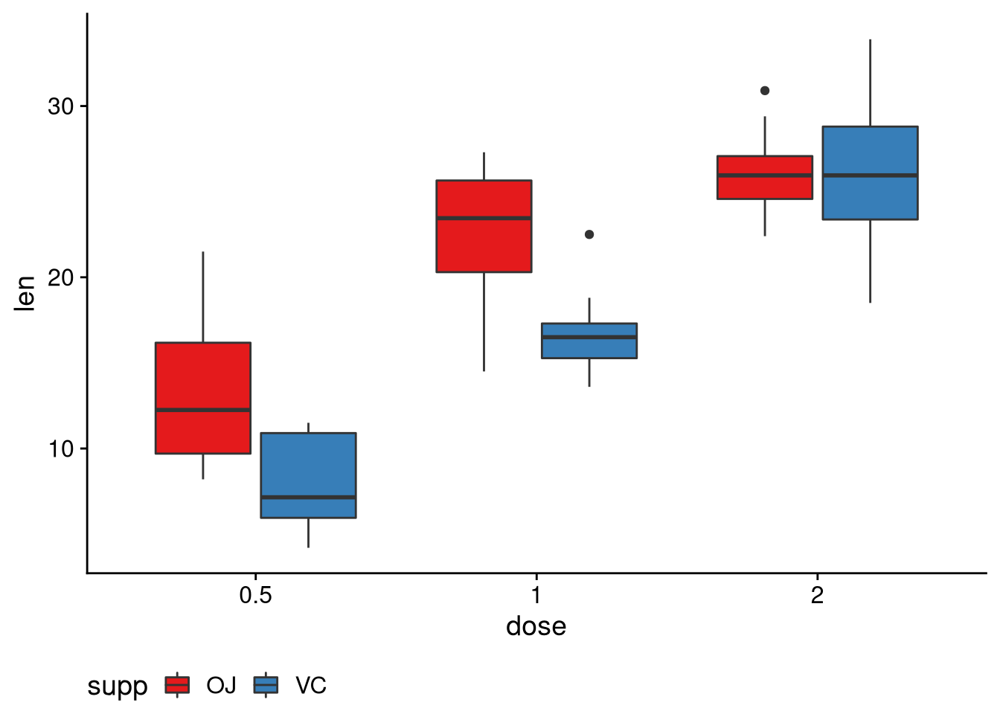
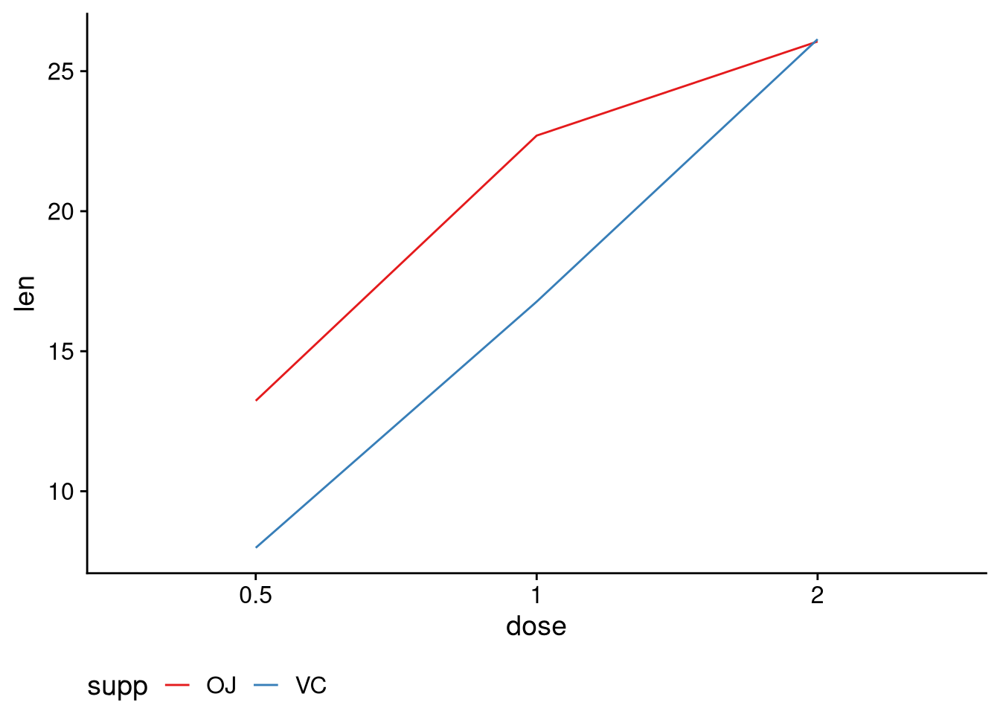

# Lecture 8: Multiple regression

```r
library(tidyverse)
library(cowplot)    # Theme
library(faraway)    # Data
library(table1)     # Table1
library(knitr)      # kable
library(kableExtra) # Pretty kables
```

## ANCOVA
The analysis of covariance (ANCOVA) is a linear model with one continuous variables and one categorical (factor) variable. We will use the `cathedral` data from the `faraway` package to demonstrate the ANCOVA model. Let's summarize it quickly.

```r
# Load data
data('cathedral')
glimpse(cathedral)
#> Rows: 25
#> Columns: 3
#> $ style <fct> r, r, r, r, r, r, r, r, r, g, g, g, g, g, g,…
#> $ x     <dbl> 75, 80, 68, 64, 83, 80, 70, 76, 74, 100, 75,…
#> $ y     <dbl> 502, 522, 425, 344, 407, 451, 551, 530, 547,…
```
Our data consists of 25 observations and 3 variables. The variables we have are `style`, `x`, and `y`. 

* `style`: The architectural style of the cathedral. It has two levels: `r` for Romanesque and `g` for Gothic.

* `x`: The nave height of the cathedral. Measured in feet.

* `y`: The length of the cathedral. Measured in feet.

Let's plot the data to see what it looks like:


```r
cathedral %>%
    ggplot(aes(x = x, y = y, color = style)) +
    geom_point() +
    scale_color_brewer(type = 'seq', palette = 'Set1') +
    theme_cowplot() +
    theme(legend.position = 'bottom')
```


There are many models we can fit to this data but we are interested in three:

1. A model which only uses `x`: one slope, one intercept.

2. A model which uses `x` and `style`: one slope, two intercepts.

3. A model which uses `x` and `style`: two slopes, two intercepts.

### The first model: one intercept, one slope
The first model which only uses `x` assumes that the data is explained by a single line. Let's fit our model and look at the results.


```r
ancovM1 <- lm(y ~ x, data = cathedral)
summary(ancovM1)
#> 
#> Call:
#> lm(formula = y ~ x, data = cathedral)
#> 
#> Residuals:
#>      Min       1Q   Median       3Q      Max 
#> -201.601  -31.241    4.378   52.097  147.745 
#> 
#> Coefficients:
#>             Estimate Std. Error t value Pr(>|t|)    
#> (Intercept)   76.420     89.258   0.856 0.400739    
#> x              4.669      1.172   3.985 0.000584 ***
#> ---
#> Signif. codes:  
#> 0 '***' 0.001 '**' 0.01 '*' 0.05 '.' 0.1 ' ' 1
#> 
#> Residual standard error: 85.83 on 23 degrees of freedom
#> Multiple R-squared:  0.4084,	Adjusted R-squared:  0.3827 
#> F-statistic: 15.88 on 1 and 23 DF,  p-value: 0.0005838
```

Let's add the regression line to the plot of our data:


```r
cathedral %>%
    ggplot(aes(x = x, y = y)) +
    geom_point(aes(color = style)) +
    stat_smooth(method = 'lm', se = F) +
    scale_color_brewer(type = 'seq', palette = 'Set1') +
    theme_cowplot() +
    theme(legend.position = 'bottom')
#> `geom_smooth()` using formula 'y ~ x'
```


### The second model: same slope, different intercepts
Looking at the plot above we might ask ourselves that maybe *two* lines describe the data better. Let's test this by adding `style` to our model.


```r
ancovM2 <- lm(y ~ x + style, data = cathedral)
summary(ancovM2)
#> 
#> Call:
#> lm(formula = y ~ x + style, data = cathedral)
#> 
#> Residuals:
#>     Min      1Q  Median      3Q     Max 
#> -172.67  -30.44   20.38   55.02   96.50 
#> 
#> Coefficients:
#>             Estimate Std. Error t value Pr(>|t|)    
#> (Intercept)   44.298     81.648   0.543   0.5929    
#> x              4.712      1.058   4.452   0.0002 ***
#> styler        80.393     32.306   2.488   0.0209 *  
#> ---
#> Signif. codes:  
#> 0 '***' 0.001 '**' 0.01 '*' 0.05 '.' 0.1 ' ' 1
#> 
#> Residual standard error: 77.53 on 22 degrees of freedom
#> Multiple R-squared:  0.5384,	Adjusted R-squared:  0.4964 
#> F-statistic: 12.83 on 2 and 22 DF,  p-value: 0.0002028
```

Look at the output. The coefficient for `x` is still the slope but now we have two intercept. We have the actual reported intercept term `(Intercept)` for the baseline level `g` and then we have **part** of the intercept term for the Romanesque style. To get the actual intercept term for level `r` we need to **add** the two terms together.


```r
sum(coefficients(ancovM2)[c(1, 3)])
#> [1] 124.6905
```

A very useful function is the `fortify()` function from the `ggplot2` package which is included with the `tidyverse` package.


```r
fortM2 <- fortify(ancovM2)
fortM2 %>% 
    as_tibble()
#> # A tibble: 25 × 9
#>        y     x style  .hat .sigma  .cooksd .fitted  .resid
#>    <dbl> <dbl> <fct> <dbl>  <dbl>    <dbl>   <dbl>   <dbl>
#>  1   502    75 r     0.111   79.2 0.00447     478.   23.9 
#>  2   522    80 r     0.117   79.2 0.00345     502.   20.4 
#>  3   425    68 r     0.119   79.2 0.00342     445.  -20.1 
#>  4   344    64 r     0.131   77.0 0.0653      426.  -82.2 
#>  5   407    83 r     0.125   75.2 0.107       516. -109.  
#>  6   451    80 r     0.117   78.5 0.0213      502.  -50.6 
#>  7   551    70 r     0.115   76.1 0.0757      455.   96.5 
#>  8   530    76 r     0.112   78.6 0.0175      483.   47.2 
#>  9   547    74 r     0.111   77.5 0.0423      473.   73.6 
#> 10   519   100 g     0.180   79.3 0.000185    515.    3.54
#> # … with 15 more rows, and 1 more variable: .stdresid <dbl>
```

The `fortify()` function gives us a data frame with the independent and dependent variables along with the predicted values and some diagnostics quantities. For this lecture we will only concern ourselves with the independent and dependent variables as well as the `.fitted` column.


```r
fortM2 <- 
    fortM2 %>%
    select(y, x, style, .fitted)
```

We can now use our fortified data frame to plot the results of our model:


```r
fortM2 %>%
    ggplot(aes(x = x, color = style)) +
    geom_point(aes(y = y)) +
    geom_line(aes(y = .fitted)) +
    scale_color_brewer(type = 'seq', palette = 'Set1') +
    theme_cowplot() + 
    theme(legend.position = 'bottom') 
```


We now see that we have two lines. They are parallel which should make sense as they have the same slope. The only difference between the two is the intercept.

### The third model: two slopes, two intercepts
Allowing two intercept seems to have improved our model. What if we allow a second slope as well? 


```r
ancovM3 <- lm(y ~ x * style, data = cathedral)
summary(ancovM3)
#> 
#> Call:
#> lm(formula = y ~ x * style, data = cathedral)
#> 
#> Residuals:
#>     Min      1Q  Median      3Q     Max 
#> -172.68  -30.22   23.75   55.78   89.50 
#> 
#> Coefficients:
#>             Estimate Std. Error t value Pr(>|t|)    
#> (Intercept)   37.111     85.675   0.433 0.669317    
#> x              4.808      1.112   4.322 0.000301 ***
#> styler       204.722    347.207   0.590 0.561733    
#> x:styler      -1.669      4.641  -0.360 0.722657    
#> ---
#> Signif. codes:  
#> 0 '***' 0.001 '**' 0.01 '*' 0.05 '.' 0.1 ' ' 1
#> 
#> Residual standard error: 79.11 on 21 degrees of freedom
#> Multiple R-squared:  0.5412,	Adjusted R-squared:  0.4757 
#> F-statistic: 8.257 on 3 and 21 DF,  p-value: 0.0008072
```

We now have four coefficients. We have the intercept `(Intercept)` and slope `x` of the regression line for the Gothic-style cathedral and we have the intercept `styler` and slope `x:styler` for the regression line of the Romanesque-style cathedral. To get the true intercept and slope for the Romanesque style we need to add the intercept terms together and the slope terms:


```r
sum(coefficients(ancovM3)[c(1, 3)])
#> [1] 241.8327
sum(coefficients(ancovM3)[c(2, 4)])
#> [1] 3.138068
```

We plot the regression lines over our data using the `fortify()` version of our data:


```r
fortify(ancovM3) %>%
    ggplot(aes(x = x, y = y, color = style)) +
    geom_point() +
    geom_line(aes(y = .fitted)) +
    scale_color_brewer(type = 'seq', palette = 'Set1') +
    theme_cowplot() +
    theme(legend.position = 'bottom')
```


### Three models, but which model?
We have fitted three models to our data. We now need some way to select the *best* model of the three, based on some measure. Let's get the coefficient of determination $R^2$ and its adjusted version for each model and compare the values:


```r
tibble(model = c('Model 1', 'Model 2', 'Model 3'), 
       r2 = c(summary(ancovM1)$r.squared, 
              summary(ancovM2)$r.squared, 
              summary(ancovM3)$r.squared), 
       r2adj = c(summary(ancovM1)$adj.r.squared, 
              summary(ancovM2)$adj.r.squared, 
              summary(ancovM3)$adj.r.squared)) %>%
    kbl() %>%
    kable_styling(full_width = F)
```

<table class="table" style="width: auto !important; margin-left: auto; margin-right: auto;">
 <thead>
  <tr>
   <th style="text-align:left;"> model </th>
   <th style="text-align:right;"> r2 </th>
   <th style="text-align:right;"> r2adj </th>
  </tr>
 </thead>
<tbody>
  <tr>
   <td style="text-align:left;"> Model 1 </td>
   <td style="text-align:right;"> 0.4084474 </td>
   <td style="text-align:right;"> 0.3827277 </td>
  </tr>
  <tr>
   <td style="text-align:left;"> Model 2 </td>
   <td style="text-align:right;"> 0.5383801 </td>
   <td style="text-align:right;"> 0.4964147 </td>
  </tr>
  <tr>
   <td style="text-align:left;"> Model 3 </td>
   <td style="text-align:right;"> 0.5412070 </td>
   <td style="text-align:right;"> 0.4756651 </td>
  </tr>
</tbody>
</table>

As you can see $R^2$ increased as we added variables to our model. This is an inherit property of $R^2$ and a reason why we can't rely on it blindly when judging the quality of our model. The adjusted $R^2$ fluctuates however. The reason for this fluctuation is that the adjusted $R^2$ penalizes the addition of variables to a model. Based on the table above, model two looks like the candidate model. We can actually test this with the `anova()` function. 

Notice how both the first and second model are "embedded" in some sense in the third model. I say this because the third model contains **all** the variables that are used in the first and second model. To test whether a "reduced" model performs better than the "full" model we use the `anova()` function:


```r
anova(ancovM2, ancovM3)
#> Analysis of Variance Table
#> 
#> Model 1: y ~ x + style
#> Model 2: y ~ x * style
#>   Res.Df    RSS Df Sum of Sq      F Pr(>F)
#> 1     22 132223                           
#> 2     21 131413  1     809.7 0.1294 0.7227
```

The null hypothesis of the test above is that adding a variable (or variables) did not improve our fit. If model three had outperformed model two we would have been able to reject the null hypothesis but we were unsuccessful. The results of the ANOVA test should not have come as a surprise when you think about the adjusted $R^2$ values and the output of the summaries of the models.

Bottom line: seems like a model with two intercepts and one slope fits the data best of the three models we constructed.

## Two-way ANOVA
The two-way ANOVA is a linear model with two categorical (factor variable) and a continuous response. We will use the `rats` data from the `faraway` package.


```r
data('rats')
glimpse(rats)
#> Rows: 48
#> Columns: 3
#> $ time   <dbl> 0.31, 0.82, 0.43, 0.45, 0.45, 1.10, 0.45, 0…
#> $ poison <fct> I, I, I, I, I, I, I, I, I, I, I, I, I, I, I…
#> $ treat  <fct> A, B, C, D, A, B, C, D, A, B, C, D, A, B, C…
```
The data consists of 48 lines and 3 columns. The variables of the data set are `time`, `poison`, and `treat`:

* `time`: The survival time of the rats. Measured in tens of hours.

* `poison`: The type of poison the rats were subjected to. The variable has three levels: `I`, `II`, and `III`.

* `treat`: The treatment the rats were subject to. The variable has four levels: `A`, `B`, `C`, and `D`.

Let's plot our data:


```r
rats %>%
    ggplot(aes(x = poison, y = time)) +
    geom_boxplot() +
    facet_wrap(~treat) +
    theme_cowplot()
```


Looking at the plots above it seems that poison III is the most potent. Similarly, treatment B seems to have the greatest efficacy. But is there an *interaction* between the two variables? That is, does the effect of one variable depend on the other? If there is no interaction, we simply use an additive model; we *add* the effects of variable $x$ to variable $y$. If there is an interaction, things can get complicated.

To check for interactions *graphically* we create an *interaction* plot:


```r
rats %>%
    ggplot(aes(x = poison, y = time, group = treat)) +
    stat_summary(aes(color = treat), fun.y = mean, geom = 'line') +
    scale_color_brewer(type = 'seq', palette = 'Set1') +
    theme_cowplot() +
    theme(legend.position = 'bottom')
#> Warning: `fun.y` is deprecated. Use `fun` instead.
```


The $x$-axis is the poison type, the $y$-axis the *mean* survival time. If the lines start crossing, we expect an interaction effect. The plot above shows that there may be some interactions, but the graphical evidence is unconvincing. Let's formally test if there is an interaction effect.


```r
anov2w <- lm(time ~ treat * poison, data = rats)
anova(anov2w)
#> Analysis of Variance Table
#> 
#> Response: time
#>              Df  Sum Sq Mean Sq F value    Pr(>F)    
#> treat         3 0.92121 0.30707 13.8056 3.777e-06 ***
#> poison        2 1.03301 0.51651 23.2217 3.331e-07 ***
#> treat:poison  6 0.25014 0.04169  1.8743    0.1123    
#> Residuals    36 0.80073 0.02224                      
#> ---
#> Signif. codes:  
#> 0 '***' 0.001 '**' 0.01 '*' 0.05 '.' 0.1 ' ' 1
```
We see that both treatment and poison seem to be significant but the interaction between the two variables `treat:poison` is not significant. We therefore conclude that the interactions are not significant.

### Same method, different data set
Let's look at another example. We will use the `ToothGrowth` data which is included with R.


```r
glimpse(ToothGrowth)
#> Rows: 60
#> Columns: 3
#> $ len  <dbl> 4.2, 11.5, 7.3, 5.8, 6.4, 10.0, 11.2, 11.2, 5…
#> $ supp <fct> VC, VC, VC, VC, VC, VC, VC, VC, VC, VC, VC, V…
#> $ dose <dbl> 0.5, 0.5, 0.5, 0.5, 0.5, 0.5, 0.5, 0.5, 0.5, …
```
The data consists of 60 lines and 3 columns. The variables of the data set are `len`, `supp`, and `dose`:

* `len`: The length of the tooth.

* `supp`: Supplement type. The variable has two levels: `OJ` (orange juice) and `VC` (vitamin C).

* `dose`: The dose in milligrams. The levels are `0.5`, `1.0`, and `2.0`.

This data set is much bigger than the `rats` one so we will summarize it quickly with the `summary()` function.


```r
summary(ToothGrowth)
#>       len        supp         dose      
#>  Min.   : 4.20   OJ:30   Min.   :0.500  
#>  1st Qu.:13.07   VC:30   1st Qu.:0.500  
#>  Median :19.25           Median :1.000  
#>  Mean   :18.81           Mean   :1.167  
#>  3rd Qu.:25.27           3rd Qu.:2.000  
#>  Max.   :33.90           Max.   :2.000
```

Notice that `dose` is treated as a continuous variable. This is something that we don't want. The numbers represent a category. We will therefore recast `dose` as a factor variable.


```r
ToothGrowth <- 
    ToothGrowth %>%
    mutate(dose = factor(dose))
```

Let's plot our data:


```r
ToothGrowth %>%
    ggplot(aes(x = dose, y = len, fill = supp)) +
    geom_boxplot() +
    scale_fill_brewer(type = 'seq', palette = 'Set1') +
    theme_cowplot() +
    theme(legend.position = 'bottom')
```



Let's also plot the interactions.


```r
ToothGrowth %>%
    ggplot(aes(x = dose, y = len, group = supp)) +
    stat_summary(aes(color = supp), fun.y = mean, geom = 'line') +
    scale_color_brewer(type = 'seq', palette = 'Set1') +
    theme_cowplot() +
    theme(legend.position = 'bottom')
#> Warning: `fun.y` is deprecated. Use `fun` instead.
```



We see that under `VC` the mean length grows nicely as we increase the dose. For the `OJ` group we see a shift going from dose `1.0` to dose `2.0`. The two treatment lines cross at dose `2.0`. Let's formally test if there is an interaction: 


```r
anov2wtooth <- lm(len ~ supp * dose, data = ToothGrowth)
anova(anov2wtooth)
#> Analysis of Variance Table
#> 
#> Response: len
#>           Df  Sum Sq Mean Sq F value    Pr(>F)    
#> supp       1  205.35  205.35  15.572 0.0002312 ***
#> dose       2 2426.43 1213.22  92.000 < 2.2e-16 ***
#> supp:dose  2  108.32   54.16   4.107 0.0218603 *  
#> Residuals 54  712.11   13.19                      
#> ---
#> Signif. codes:  
#> 0 '***' 0.001 '**' 0.01 '*' 0.05 '.' 0.1 ' ' 1
```
This time we see that the supplement, dose AND interaction between those two variables are significant.

## Multiple linear regression
There is no reason to stop at three variables. We can continuously add variables to our model and R will happily fit it for us. 


```r
pulse <- read_csv2('https://notendur.hi.is/thj73/data/pulseEn.csv')
summary(lm(secondPulse ~ firstPulse*intervention + sex + height + weight, data = pulse))
#> 
#> Call:
#> lm(formula = secondPulse ~ firstPulse * intervention + sex + 
#>     height + weight, data = pulse)
#> 
#> Residuals:
#>     Min      1Q  Median      3Q     Max 
#> -29.622  -5.599  -0.322   3.788  53.701 
#> 
#> Coefficients:
#>                                     Estimate Std. Error
#> (Intercept)                        33.936496   6.050011
#> firstPulse                          0.880819   0.075194
#> interventionstationary            -31.353887   7.469346
#> sex                                -0.752416   1.227185
#> height                              0.008287   0.006409
#> weight                              0.002131   0.006963
#> firstPulse:interventionstationary   0.074302   0.101535
#>                                   t value Pr(>|t|)    
#> (Intercept)                         5.609 3.61e-08 ***
#> firstPulse                         11.714  < 2e-16 ***
#> interventionstationary             -4.198 3.27e-05 ***
#> sex                                -0.613    0.540    
#> height                              1.293    0.197    
#> weight                              0.306    0.760    
#> firstPulse:interventionstationary   0.732    0.465    
#> ---
#> Signif. codes:  
#> 0 '***' 0.001 '**' 0.01 '*' 0.05 '.' 0.1 ' ' 1
#> 
#> Residual standard error: 12.18 on 436 degrees of freedom
#>   (28 observations deleted due to missingness)
#> Multiple R-squared:  0.6795,	Adjusted R-squared:  0.6751 
#> F-statistic:   154 on 6 and 436 DF,  p-value: < 2.2e-16
```

That's not to say that more is always better. The general rule of thumb is **parsimony** or smaller is better. We want our model to generalize to data that it hasn't seen before (predict). If we tailor our model too closely to the data we use to construct it we run at risk of **overfitting**.

### The problem of overfitting
I am going to create fake data set to demonstrate the danger of overfitting. First I create the "truth". I want my dependent variable $y$ to be created from independent variable $x$. I want them to be related in the following way:

$$
y = 1 + 2 \cdot x = \beta _ 0 + \beta _ 1 x.
$$

Of course there needs to be some sort of randomness in the model because otherwise there would be no point in the analysis. I therefore add $\varepsilon \sim N(0, \sigma ^2) = N(0, 3^2)$ to the data to create fluctuations. 


```r
# Create data
set.seed(1)
n <- 10
x <- rnorm(n = n, mean = 1, sd = 2)
y <- 1 + 2 * x + rnorm(n = n, mean = 0, sd = 3)
overData <- data.frame(x, y)
```

Let's fit a linear model to this data and see what we get:


```r
lmSmall <- lm(y ~ x, data = overData)
summary(lmSmall)
#> 
#> Call:
#> lm(formula = y ~ x, data = overData)
#> 
#> Residuals:
#>     Min      1Q  Median      3Q     Max 
#> -5.1252 -1.8286  0.4301  2.5616  3.0235 
#> 
#> Coefficients:
#>             Estimate Std. Error t value Pr(>|t|)  
#> (Intercept)   2.7254     1.3108   2.079   0.0712 .
#> x             1.2258     0.6731   1.821   0.1061  
#> ---
#> Signif. codes:  
#> 0 '***' 0.001 '**' 0.01 '*' 0.05 '.' 0.1 ' ' 1
#> 
#> Residual standard error: 3.152 on 8 degrees of freedom
#> Multiple R-squared:  0.2931,	Adjusted R-squared:  0.2047 
#> F-statistic: 3.316 on 1 and 8 DF,  p-value: 0.1061
```

The results are kinda poor but that's OK; this is just an example. Let's add more variables to the data.


```r
overData <- 
    overData %>%
    mutate(x2 = x^2, x3 = x^3, 
           x4 = x^4, x5 = x^5, 
           x6 = x^6, x7 = x^7, 
           x8 = x^8)
```

Notice now what happens when I fit a model which includes **all** of the variables.


```r
lmFull <- lm(y ~ ., data = overData)
summary(lmFull)
#> 
#> Call:
#> lm(formula = y ~ ., data = overData)
#> 
#> Residuals:
#>          1          2          3          4          5 
#> -7.619e-02 -5.659e-01 -2.188e-01  7.279e-05  1.308e+00 
#>          6          7          8          9         10 
#>  2.595e-01 -1.734e+00 -1.127e-01  1.058e+00  8.274e-02 
#> 
#> Coefficients:
#>             Estimate Std. Error t value Pr(>|t|)
#> (Intercept)   4.6104     5.3893   0.855    0.549
#> x            -3.3422     7.7297  -0.432    0.740
#> x2           -1.6993    61.1088  -0.028    0.982
#> x3           10.8544    51.8809   0.209    0.869
#> x4          -12.8163    78.8381  -0.163    0.897
#> x5           11.0604   122.0096   0.091    0.942
#> x6           -6.2146    68.9239  -0.090    0.943
#> x7            1.7458    17.3631   0.101    0.936
#> x8           -0.1794     1.6103  -0.111    0.929
#> 
#> Residual standard error: 2.509 on 1 degrees of freedom
#> Multiple R-squared:  0.944,	Adjusted R-squared:  0.4961 
#> F-statistic: 2.108 on 8 and 1 DF,  p-value: 0.4896
```

Notice how large $R^2$. It's almost 1 which is as good as it can get! Let's plot the two regression "lines" we get from the fit to see what is actually going on. We begin by adding the predicted model values to our data and then reduce the data set and pivot it to the long format.


```r
overDataLong <- 
    overData %>%
    mutate(smallPred = predict(lmSmall), 
           fullPred = predict(lmFull)) %>%
    select(x, y, smallPred, fullPred) %>%
    gather(regression, value, -x, -y)
overDataLong
#>             x          y regression      value
#> 1  -0.2529076  5.0295283  smallPred  2.4154335
#> 2   1.3672866  4.9041030  smallPred  4.4014570
#> 3  -0.6712572 -2.2062362  smallPred  1.9026233
#> 4   4.1905616  2.7370235  smallPred  7.8622089
#> 5   1.6590155  7.6928238  smallPred  4.7590564
#> 6  -0.6409368 -0.4166744  smallPred  1.9397899
#> 7   1.9748581  4.9011454  smallPred  5.1462141
#> 8   2.4766494  8.7848075  smallPred  5.7613066
#> 9   2.1515627  7.7667890  smallPred  5.3628174
#> 10  0.3892232  3.5601504  smallPred  3.2025533
#> 11 -0.2529076  5.0295283   fullPred  5.1057217
#> 12  1.3672866  4.9041030   fullPred  5.4700126
#> 13 -0.6712572 -2.2062362   fullPred -1.9874255
#> 14  4.1905616  2.7370235   fullPred  2.7369508
#> 15  1.6590155  7.6928238   fullPred  6.3851049
#> 16 -0.6409368 -0.4166744   fullPred -0.6761837
#> 17  1.9748581  4.9011454   fullPred  6.6351488
#> 18  2.4766494  8.7848075   fullPred  8.8975269
#> 19  2.1515627  7.7667890   fullPred  6.7091933
#> 20  0.3892232  3.5601504   fullPred  3.4774106
```

Now let's plot the lines:


```r
overDataLong %>%
    ggplot(aes(x = x)) +
    geom_point(aes(y = y)) +
    geom_line(aes(y = value, color = regression)) +
    scale_color_brewer(type = 'seq', palette = 'Set1') +
    theme_cowplot() +
    theme(legend.position = 'bottom')
```


The full model goes out of its way to be as close to each data point as it can. This may seem nice on paper but the full model is completely useless to make prediction; even **interpolation** is useless. Let's see what happens. The range of `x` is roughly from 0 to 4. Let's see what happens if we make the model predict for `x = 3`. 


```r
newPredict <- data.frame(x = 3, x2 = 3^2, x3 = 3^3, 
                         x4 = 3^4, x5 = 3^5, x6 = 3^6, 
                         x7 = 3^7, x8 = 3^8)
predict(lmFull, newPredict)
#>        1 
#> 32.43703
```

The model predicts 32.4370343 which is a *terrible* estimate. The model is **useless**. It doesn't generalize.

To finish this section off I'm going to fit ever-increasing models on this data to better show you how $R^2$ and adjusted $R^2$ behave. I include the code but don't worry if you don't understand it.


```r
X <- model.matrix(lmFull)[, -1]
lmNull <- lm(y ~ 1, data = overData)
r2Data <- list()
for(i in 1:ncol(X)) {
    lmTmp <- update(lmNull, . ~ . + X[, 1:i])
    tmp <- data.frame(pred = (i + 1), 
                      r2 = summary(lmTmp)$r.squared, 
                      r2adj = summary(lmTmp)$adj.r.squared)
    r2Data[[i]] <- tmp
}
do.call(rbind, r2Data) %>%
    gather(type, val, -pred) %>%
    mutate(pred = factor(pred)) %>%
    ggplot(aes(x = pred, y = val, color = type, group = type, lty = type)) +
    geom_point() +
    geom_line() +
    scale_color_brewer(type = 'seq', palette = 'Set1') +
    theme_cowplot() +
    labs(x = 'Number of predictors', y = 'Value') +
    theme(legend.position = 'bottom')
```


As you can see, $R^2$ increases as we add more variables but $R^2$ adjusted fluctuates. This is why $R^2$ adjusted is typically used when model performance is being evaluated.


