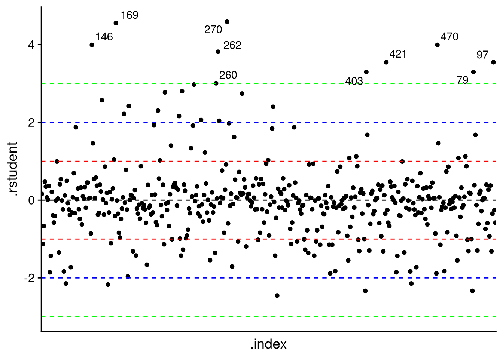
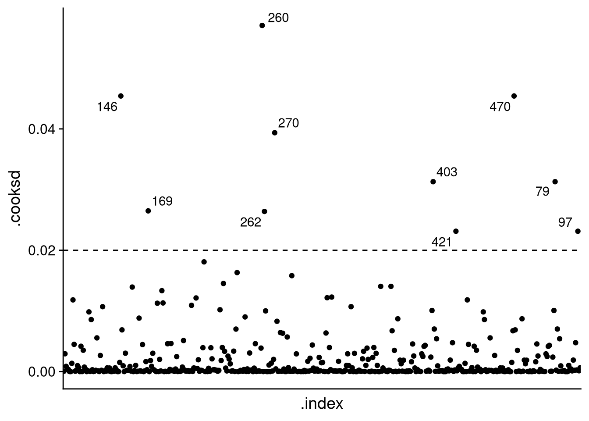
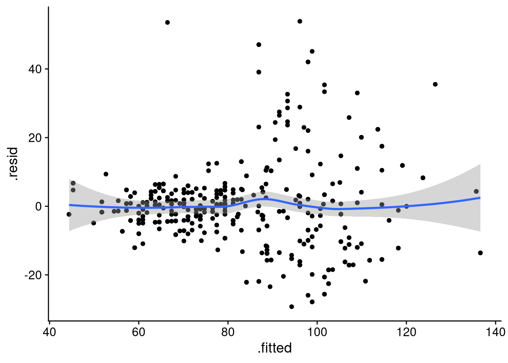
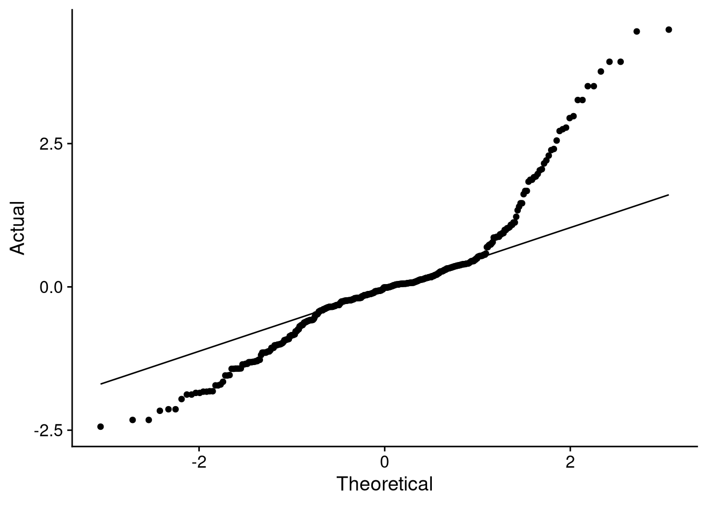

# Lecture 9: Diagnostics


```r
library(tidyverse)
library(ggrepel)
library(cowplot)
library(knitr)
library(kableExtra)
```

After fitting a model it is important to diagnose it. Things we need to examine are:

1. High leverage points, outliers, and influential points.

2. The assumptions of linear regression: linearity, normality, heteroskedasticity.

We will be using the pulse data to fit a model which we will then diagnose.


```r
pulse <- read_csv2('https://notendur.hi.is/thj73/data/pulseEn.csv') 
```

The model we will fit is the following:


```r
lm1 <- lm(secondPulse ~ firstPulse + intervention, data = pulse)
```

Let's look at the summary of our model:


```r
summary(lm1)
#> 
#> Call:
#> lm(formula = secondPulse ~ firstPulse + intervention, data = pulse)
#> 
#> Residuals:
#>     Min      1Q  Median      3Q     Max 
#> -29.274  -4.883  -0.122   3.838  53.886 
#> 
#> Coefficients:
#>                         Estimate Std. Error t value
#> (Intercept)             31.71432    3.68556   8.605
#> firstPulse               0.91999    0.04822  19.078
#> interventionstationary -25.99111    1.16796 -22.253
#>                        Pr(>|t|)    
#> (Intercept)              <2e-16 ***
#> firstPulse               <2e-16 ***
#> interventionstationary   <2e-16 ***
#> ---
#> Signif. codes:  
#> 0 '***' 0.001 '**' 0.01 '*' 0.05 '.' 0.1 ' ' 1
#> 
#> Residual standard error: 12.04 on 451 degrees of freedom
#>   (17 observations deleted due to missingness)
#> Multiple R-squared:  0.6903,	Adjusted R-squared:  0.689 
#> F-statistic: 502.7 on 2 and 451 DF,  p-value: < 2.2e-16
```

As you can see, all coefficients are highly significant and our adjusted $R^2$ value is 0.688974. As our model is an ANCOVA model (one continuous variable, one categorical variable) with two intercepts and one slope we can plot the regression lines over our data.


```r
intercept1 <- coef(lm1)[1]
intercept2 <- sum(coef(lm1)[c(1, 3)])
slope <- coef(lm1)[2]
pulse %>%
    na.omit() %>%
    ggplot(aes(x = firstPulse, y = secondPulse, color = intervention)) +
    geom_point() +
    geom_abline(slope = slope, intercept = intercept1, lty = 2) +
    geom_abline(slope = slope, intercept = intercept2, lty = 3) +
    scale_color_brewer(type = 'seq', palette = 'Set1') +
    theme_cowplot() +
    theme(legend.position = 'bottom')
```


Having fitted our model it's time to diagnose it. We will use the `fortify()` function to create a data set which contains (almost) all the variables we need to diagnose the model. I say almost because we need to add the *studentized* residuals to the data set. We will talk about studentized residuals when we discuss outliers.


```r
flm1 <- fortify(lm1)            
flm1$.rstudent <- rstudent(lm1) # studentized residuals
flm1$.index <- rownames(flm1)   # observation number
k <- ncol(model.matrix(lm1))    # number of predictors
n <- nrow(model.matrix(lm1))    # number of observations
flm1 <- 
    flm1 %>%
    relocate(.index, .before = 'secondPulse')
```

## Leverages, outliers, and influential points

### Leverage points
Leverages are a way to quantify any "weirdness" in our independent variables. The mathematics of leverages rely on the hat matrix $H$ which we will not discuss as it requires linear algebra. Leverages are between 0 and 1, where a higher leverage implies more "weirdness" in the independent variables. To differentiate between *high* and *not-high* leverages we will use the heuristic of $2k/n$ where $k$ is the number of predictors in the model and $n$ the number of observations used in the modeling process. 

The variable `.hat` in the fortified data represents our leverage values which we will denote with $h_i$ where $i$ is the $i$-th row in the data. Let's plot these values and label any point that exceeds our threshold.


```r
flm1 %>%
    ggplot(aes(x = .index, y = .hat)) +
    geom_point() +
    geom_text_repel(aes(label = ifelse(.hat > 2*k/n, .index, ''))) +
    geom_hline(yintercept = 2*k/n, lty = 2) +
    theme_cowplot() +
    theme(axis.ticks.x = element_blank(), 
          axis.text.x = element_blank())
```


Many data points seem to have a leverage value which exceeds our threshold. The values are relatively small however; remember that it the leverage is between 0 and 1 where a larger value implies more "strangeness". Let's take a look at the data of the point with the highest leverage. 


```r
flm1 %>%
    filter(.index == 170) %>%
    kbl() %>%
    kable_styling(full_width = F)
```

<table class="table" style="width: auto !important; margin-left: auto; margin-right: auto;">
 <thead>
  <tr>
   <th style="text-align:left;"> .index </th>
   <th style="text-align:right;"> secondPulse </th>
   <th style="text-align:right;"> firstPulse </th>
   <th style="text-align:left;"> intervention </th>
   <th style="text-align:right;"> .hat </th>
   <th style="text-align:right;"> .sigma </th>
   <th style="text-align:right;"> .cooksd </th>
   <th style="text-align:right;"> .fitted </th>
   <th style="text-align:right;"> .resid </th>
   <th style="text-align:right;"> .stdresid </th>
   <th style="text-align:right;"> .rstudent </th>
  </tr>
 </thead>
<tbody>
  <tr>
   <td style="text-align:left;"> 170 </td>
   <td style="text-align:right;"> 112 </td>
   <td style="text-align:right;"> 120 </td>
   <td style="text-align:left;"> stationary </td>
   <td style="text-align:right;"> 0.0428289 </td>
   <td style="text-align:right;"> 12.05331 </td>
   <td style="text-align:right;"> 0.0018259 </td>
   <td style="text-align:right;"> 116.122 </td>
   <td style="text-align:right;"> -4.121973 </td>
   <td style="text-align:right;"> -0.3498865 </td>
   <td style="text-align:right;"> -0.3495458 </td>
  </tr>
</tbody>
</table>


### Outliers
Outliers are "strange" dependent values. Our main tool to detect outliers are the studentized residuals $t_i$. The studentized residuals are computed from the *standardized* residuals $r_i$. Here is how both are defined:

$$
r_i = \frac{e_i}{\sqrt{1 - h_i}\hat{\sigma}}, \quad t_i = r_i \sqrt{\frac{n - k - 1}{n - k - r_i^2}}
$$

Here, $e_i$ is the residual from our model, $h_i$ is the leverage, $\hat{\sigma}$ is our estimate of $\sigma$, and $n$ and $k$ are as before. The standardized residual has that name because we have standardized the residual from our model.

For the *studentized* residual we define the following heuristic: if the studentized residual exceeds -3 or 3 we will mark that point as a potential outlier. 


```r
flm1 %>%
    ggplot(aes(x = .index, y = .rstudent)) +
    geom_point() +
    geom_hline(yintercept = 0, lty = 2) +
    geom_hline(yintercept = 1, lty = 2, col = 'red') +
    geom_hline(yintercept = -1, lty = 2, col = 'red') +
    geom_hline(yintercept = 2, lty = 2, col = 'blue') +
    geom_hline(yintercept = -2, lty = 2, col = 'blue') +
    geom_hline(yintercept = 3, lty = 2, col = 'green') +
    geom_hline(yintercept = -3, lty = 2, col = 'green') +
    geom_text_repel(aes(label = ifelse(abs(.rstudent) > 3, .index, ''))) +
    theme_cowplot() + 
    theme(axis.ticks.x = element_blank(), 
          axis.text.x = element_blank())
```



We see that 10 values exceed our threshold and will therefore be subjected to further testing. Under the null hypothesis our studentized residual should come from a $t$-distribution with $n - k - 1$ degrees of freedom. We will reject the null hypothesis if our studentized residual value exceeds our theoretical $t$-value. As we will test every residual we need to divide our significance level $\alpha = 0.05$ between the tests. Therefore, our theoretical $t$-value is $t_{1 - \frac{\alpha}{2n}, n - p - 1}$. We are distributing our significance level equally between the tests; this method of equally distributing the significance level is called Bonferroni's correction.


```r
tval <- qt(p = 1 - 0.05/(2 * n), df = n - k - 1)    # theoretical value
flm1 %>%
    mutate(rejectNull = abs(.rstudent) > tval) %>%
    filter(rejectNull == T) %>%
    kbl() %>%
    kable_styling(full_width = F)
```

<table class="table" style="width: auto !important; margin-left: auto; margin-right: auto;">
 <thead>
  <tr>
   <th style="text-align:left;"> .index </th>
   <th style="text-align:right;"> secondPulse </th>
   <th style="text-align:right;"> firstPulse </th>
   <th style="text-align:left;"> intervention </th>
   <th style="text-align:right;"> .hat </th>
   <th style="text-align:right;"> .sigma </th>
   <th style="text-align:right;"> .cooksd </th>
   <th style="text-align:right;"> .fitted </th>
   <th style="text-align:right;"> .resid </th>
   <th style="text-align:right;"> .stdresid </th>
   <th style="text-align:right;"> .rstudent </th>
   <th style="text-align:left;"> rejectNull </th>
  </tr>
 </thead>
<tbody>
  <tr>
   <td style="text-align:left;"> 146 </td>
   <td style="text-align:right;"> 134 </td>
   <td style="text-align:right;"> 60 </td>
   <td style="text-align:left;"> active </td>
   <td style="text-align:right;"> 0.0087565 </td>
   <td style="text-align:right;"> 11.84699 </td>
   <td style="text-align:right;"> 0.0454224 </td>
   <td style="text-align:right;"> 86.91370 </td>
   <td style="text-align:right;"> 47.08630 </td>
   <td style="text-align:right;"> 3.927545 </td>
   <td style="text-align:right;"> 3.992052 </td>
   <td style="text-align:left;"> TRUE </td>
  </tr>
  <tr>
   <td style="text-align:left;"> 169 </td>
   <td style="text-align:right;"> 120 </td>
   <td style="text-align:right;"> 66 </td>
   <td style="text-align:left;"> stationary </td>
   <td style="text-align:right;"> 0.0039850 </td>
   <td style="text-align:right;"> 11.78652 </td>
   <td style="text-align:right;"> 0.0264880 </td>
   <td style="text-align:right;"> 66.44253 </td>
   <td style="text-align:right;"> 53.55747 </td>
   <td style="text-align:right;"> 4.456602 </td>
   <td style="text-align:right;"> 4.553042 </td>
   <td style="text-align:left;"> TRUE </td>
  </tr>
  <tr>
   <td style="text-align:left;"> 270 </td>
   <td style="text-align:right;"> 150 </td>
   <td style="text-align:right;"> 70 </td>
   <td style="text-align:left;"> active </td>
   <td style="text-align:right;"> 0.0058288 </td>
   <td style="text-align:right;"> 11.78266 </td>
   <td style="text-align:right;"> 0.0393666 </td>
   <td style="text-align:right;"> 96.11360 </td>
   <td style="text-align:right;"> 53.88640 </td>
   <td style="text-align:right;"> 4.488130 </td>
   <td style="text-align:right;"> 4.586752 </td>
   <td style="text-align:left;"> TRUE </td>
  </tr>
  <tr>
   <td style="text-align:left;"> 470 </td>
   <td style="text-align:right;"> 134 </td>
   <td style="text-align:right;"> 60 </td>
   <td style="text-align:left;"> active </td>
   <td style="text-align:right;"> 0.0087565 </td>
   <td style="text-align:right;"> 11.84699 </td>
   <td style="text-align:right;"> 0.0454224 </td>
   <td style="text-align:right;"> 86.91370 </td>
   <td style="text-align:right;"> 47.08630 </td>
   <td style="text-align:right;"> 3.927545 </td>
   <td style="text-align:right;"> 3.992052 </td>
   <td style="text-align:left;"> TRUE </td>
  </tr>
</tbody>
</table>

Four points stand out. Let's remember their indices as we continue to diagnose the model.


### Influential data points
An influential data point is a data point whose removal from the data causes large changes in the fit. When the misbehaving data points are singular, that is, there is only one, it can usually be identified quickly and a decision can be made whether to include it or not. However, when there are multiple strange data points they may mask the effect of each other. One of the best ways to determine whether a data point is influential is by examining the studentized residual and the leverages. However, it would be nice if we could somehow combine those two quantities into a single measure to help us with our analysis. That is exactly the purpose of Cook’s distance, which we define as:

$$
C_i = \frac{r_i^2}{k} \frac{h_i}{(1 - h_i)}
$$

So what constitutes a "high" Cook’s distance? It’s relative. Generally you calculate $C_i$ for all your data points, plot them and inspect data points which have a considerably larger $C_i$ value relative to other data points.


```r
flm1 %>%
    ggplot(aes(x = .index, y = .cooksd)) +
    geom_point() +
    geom_hline(yintercept = 0.02, lty = 2) +
    geom_text_repel(aes(label = ifelse(.cooksd > 0.02, .index, ''))) +
    theme_cowplot() + 
    theme(axis.ticks.x = element_blank(), 
          axis.text.x = element_blank())
```



We see some influential points. Of the influential points we see some old acquaintances. These are the points we should focus our attention on.

## Assumptions of linear regression

### Heteroskedasticity and linearity
The most important plot to examine linearity and heteroskedasticity is the fitted-values-versus-residuals plot:


```r
flm1 %>%
    ggplot(aes(x = .fitted, y = .resid)) +
    geom_point() +
    stat_smooth(method = 'loess') +
    theme_cowplot()
#> `geom_smooth()` using formula 'y ~ x'
```


From the plot above we don't really see any evidence of non-linearity however there seems to be evidence of heteroskedasticity. We see this because as `.fitted` increases so does the size of `.resid`. 

Another important plot is the residual plot. You can choose to plot the residuals or the standardized residuals, I prefer the standardized residuals. 


```r
flm1 %>%
    ggplot(aes(x = .index, y = .stdresid)) +
    geom_point() +
    geom_hline(yintercept = 0, lty = 2) +
    theme_cowplot() +
    theme(axis.ticks.x = element_blank(), 
          axis.text.x = element_blank())
```


We use the plot above to evaluate heteroskedasticity as well. It isn't as obvious on this plot, hence why the fitted-values-versus-residuals plot is the most important one. You should always look at it anyways. 

### Normality
We use the $QQ$-plot to assess the normal distribution. The $x$-axis is the theoretical distribution; the $y$-axis is the distribution of our residuals. 


```r
flm1 %>%
    ggplot(aes(sample = .stdresid)) +
    stat_qq() +
    stat_qq_line() +
    theme_cowplot()  +
    labs(x = 'Theoretical', y = 'Actual')
```



Our model completely fails the normal assumption. There are some extremely heavy tails. 


## What should we do?

* *High-leverage points, outliers, and influential points*: Check the data for data entry errors; examine the physical context; exclude the data point. If you choose to exclude the data point you should always report that you did so and why you did it. Otherwise you run at risk of being accused of dishonesty.

* *Non-normality, linearity*: Transform the response (dependent) variable; add/remove/transform independent variables; change the assumption of the normal assumption (Binomial, Gamma, etc).

* *Non-constant variance, correlated errors*: Use the generalized least square method. You need to estimate the error structure.

This process requires many iterations of fitting and diagnostics. 


