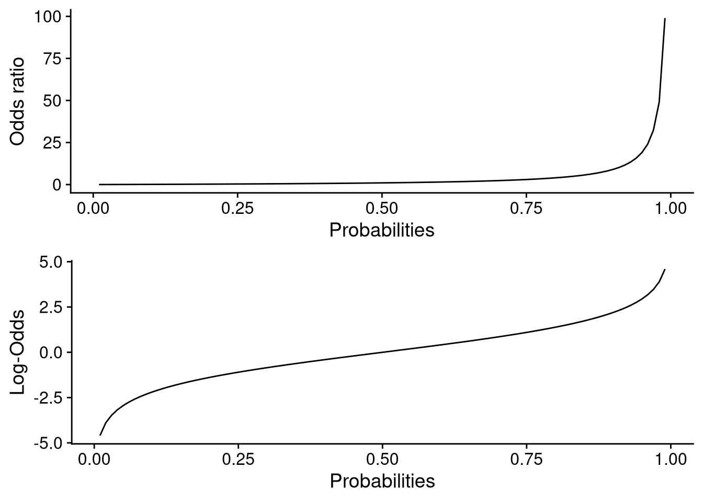

# Lecture 11: Logistic regression


```r
library(tidyverse)
library(epitools)       # data
library(cowplot)
library(gridExtra)
```

## The data
We will use data from the [Western Collaborative Group Study (WCGS)](https://clinicaltrials.gov/ct2/show/NCT00005174) which was a cohort study including men in California. The men had various risk factors measured at baseline and were then followed until the age of 70, to death, or the occurrence of heart disease, depending on which came first.

The data is included in the package *epitools*.


```r
data('wcgs')
```

The data set consists of 3154 observations and 14 variables. Let's summarize the data quickly with the `summary()` function.


```r
summary(wcgs)
#>        id             age0          height0     
#>  Min.   : 2001   Min.   :39.00   Min.   :60.00  
#>  1st Qu.: 3741   1st Qu.:42.00   1st Qu.:68.00  
#>  Median :11406   Median :45.00   Median :70.00  
#>  Mean   :10478   Mean   :46.28   Mean   :69.78  
#>  3rd Qu.:13115   3rd Qu.:50.00   3rd Qu.:72.00  
#>  Max.   :22101   Max.   :59.00   Max.   :78.00  
#>                                                 
#>     weight0         sbp0            dbp0       
#>  Min.   : 78   Min.   : 98.0   Min.   : 58.00  
#>  1st Qu.:155   1st Qu.:120.0   1st Qu.: 76.00  
#>  Median :170   Median :126.0   Median : 80.00  
#>  Mean   :170   Mean   :128.6   Mean   : 82.02  
#>  3rd Qu.:182   3rd Qu.:136.0   3rd Qu.: 86.00  
#>  Max.   :320   Max.   :230.0   Max.   :150.00  
#>                                                
#>      chol0          behpat0          ncigs0    
#>  Min.   :103.0   Min.   :1.000   Min.   : 0.0  
#>  1st Qu.:197.2   1st Qu.:2.000   1st Qu.: 0.0  
#>  Median :223.0   Median :2.000   Median : 0.0  
#>  Mean   :226.4   Mean   :2.523   Mean   :11.6  
#>  3rd Qu.:253.0   3rd Qu.:3.000   3rd Qu.:20.0  
#>  Max.   :645.0   Max.   :4.000   Max.   :99.0  
#>  NA's   :12                                    
#>     dibpat0           chd69            typechd      
#>  Min.   :0.0000   Min.   :0.00000   Min.   :0.0000  
#>  1st Qu.:0.0000   1st Qu.:0.00000   1st Qu.:0.0000  
#>  Median :1.0000   Median :0.00000   Median :0.0000  
#>  Mean   :0.5038   Mean   :0.08148   Mean   :0.1363  
#>  3rd Qu.:1.0000   3rd Qu.:0.00000   3rd Qu.:0.0000  
#>  Max.   :1.0000   Max.   :1.00000   Max.   :3.0000  
#>                                                     
#>     time169         arcus0      
#>  Min.   :  18   Min.   :0.0000  
#>  1st Qu.:2842   1st Qu.:0.0000  
#>  Median :2942   Median :0.0000  
#>  Mean   :2684   Mean   :0.2985  
#>  3rd Qu.:3037   3rd Qu.:1.0000  
#>  Max.   :3430   Max.   :1.0000  
#>                 NA's   :2
```

We are going to focus our attention on two variables (for now): `sbp0` and `chd69`.

* `sbp0`: This variable represents the systolic blood pressure of the study participant at baseline.

* `chd69`: This variable takes on the value of 1 if the study participant suffered from heart disease before turning 70 and 0 otherwise.

We are going to create a new variable which takes on the value of 1 if the study participant had a systolic blood pressure exceeding 130 at baseline and 0 otherwise. We will call this variable `htn`, short for hypertension. We will also create factor versions of `htn` and `chd69` where we replace 0 and 1 with text.


```r
wcgs <-
    wcgs %>%
    mutate(htn = ifelse(sbp0 > 130, 1, 0), 
           htnf = factor(htn, labels = c('No htn', 'Yes htn')), 
           chd69f = factor(chd69, labels = c('No chd', 'Yes chd')))
```

## A test of two proportions

Now let's create a simple counts table based on the variables `htnf` and `chd69f`.


```r
table(wcgs$htnf, wcgs$chd69f)
#>          
#>           No chd Yes chd
#>   No htn    1916     131
#>   Yes htn    981     126
```

Let's get the proportions version of this table:


```r
prop.table(table(wcgs$htnf, wcgs$chd69f), margin = 1)
#>          
#>               No chd    Yes chd
#>   No htn  0.93600391 0.06399609
#>   Yes htn 0.88617886 0.11382114
```

From the table above we see that roughly 6% of participants *without* hypertension suffered from heart disease versus the 11% of participants *with* hypertension. Let's see if there is a statistically significant difference of proportions.


```r
prop.test(table(wcgs$htnf, wcgs$chd69f))
#> 
#> 	2-sample test for equality of proportions with
#> 	continuity correction
#> 
#> data:  table(wcgs$htnf, wcgs$chd69f)
#> X-squared = 23.17, df = 1, p-value = 1.483e-06
#> alternative hypothesis: two.sided
#> 95 percent confidence interval:
#>  0.02762490 0.07202519
#> sample estimates:
#>    prop 1    prop 2 
#> 0.9360039 0.8861789
```

Note that this is testing the proportions of *not* getting heart disease. Due to symmetry it doesn't matter which proportion we test but for completeness' sake we can switch the proportions being tested:


```r
prop.test(table(wcgs$htnf, wcgs$chd69f)[2:1, 2:1])
#> 
#> 	2-sample test for equality of proportions with
#> 	continuity correction
#> 
#> data:  table(wcgs$htnf, wcgs$chd69f)[2:1, 2:1]
#> X-squared = 23.17, df = 1, p-value = 1.483e-06
#> alternative hypothesis: two.sided
#> 95 percent confidence interval:
#>  0.02762490 0.07202519
#> sample estimates:
#>     prop 1     prop 2 
#> 0.11382114 0.06399609
```

As you can see we get the same test statistic and $p$-value; we have merely changed our "perspective". From the output we see that the null hypothesis is rejected.


### The odds ratio
Let $\pi$ be some probability of an event happening. Then, since probabilities must add up to one, $1-\pi$ is the probability of an event *not* happening. The odds $\mathcal{O}$ is defined as the ratio of these two probabilities:

$$
\mathcal{O} = \frac{\pi}{1 - \pi}
$$

So what exactly is an *odds ratio*? Well, the *odds ratio* is just the ratio of two odds!

$$
\mbox{Odds ratio} = \frac{\mathcal{O}_ 1}{\mathcal{O}_ 2} = \frac{\frac{\pi _ 1}{1 - \pi _ 1}}{\frac{\pi _ 2}{1 - \pi _ 2}}
$$

Now, let's think again about the proportions in our table:


```r
prop.table(table(wcgs$htnf, wcgs$chd69f), margin = 1)
#>          
#>               No chd    Yes chd
#>   No htn  0.93600391 0.06399609
#>   Yes htn 0.88617886 0.11382114
```

Our rows sum up to one. It doesn't take a huge leap of faith to consider these proportions as probabilities. That is to say, given that a participant *does not suffer* from hypertension, the *probability* of that participant suffering from heart disease is roughly 6%. We can thus convert our probabilities to odds:


```r
odds1 <- 0.064/0.936    # no hypertension
odds2 <- 0.114/0.886    # hypertension
c(odds1, odds2)
#> [1] 0.06837607 0.12866817
```

Consequently, the odds ratio is:


```r
odds2/odds1
#> [1] 1.881772
```

The numerator here is the odds of heart disease given hypertension and the denominator is the odds of heart disease given no hypertension.

### Interpreting the odds ratio
Since the odds ratio was greater than one we interpret that the following way: the odds of heart disease for a person with hypertension is **greater** than a person *without* hypertension. In general, the following holds:

* Odds ratio greater than 1: Increased odds.

* Odds ratio less than 1: Decreased odds.

* Odds ratio equal to 1: No difference.

### The hypothesis test
The (two-sided) hypothesis test for the odds ratio is as follows:

$$
\begin{aligned}
H_0&: \mbox{ Odds ratio } = 1,\\
H_1&: \mbox{ Odds ratio } \neq 1.
\end{aligned}
$$

We can test this hypothesis with *Fisher's exact test* using the `fisher.test()` function in R.


```r
fisher.test(table(wcgs$htnf, wcgs$chd69f))
#> 
#> 	Fisher's Exact Test for Count Data
#> 
#> data:  table(wcgs$htnf, wcgs$chd69f)
#> p-value = 2.178e-06
#> alternative hypothesis: true odds ratio is not equal to 1
#> 95 percent confidence interval:
#>  1.440895 2.447598
#> sample estimates:
#> odds ratio 
#>   1.878226
```

We strongly reject the null hypothesis.

## Logistic regression
A logistic regression model is a linear model. It differs from the linear model we have been using throughout this course as it *does not assume the normal distribution*. **The underlying distribution of logistic regression is the binomial distribution**. Before going into the details of logistic regression we should fit such a model and examine the results. To fit a logistic regression model we use the `glm()` function. Let's redo the odds-ratio calculations from before with a logistic model.


```r
lr1 <- glm(chd69 ~ htn, family = 'binomial', data = wcgs)
summary(lr1)
#> 
#> Call:
#> glm(formula = chd69 ~ htn, family = "binomial", data = wcgs)
#> 
#> Deviance Residuals: 
#>     Min       1Q   Median       3Q      Max  
#> -0.4916  -0.4916  -0.3637  -0.3637   2.3447  
#> 
#> Coefficients:
#>             Estimate Std. Error z value Pr(>|z|)    
#> (Intercept) -2.68280    0.09031  -29.71  < 2e-16 ***
#> htn          0.63051    0.13081    4.82 1.44e-06 ***
#> ---
#> Signif. codes:  
#> 0 '***' 0.001 '**' 0.01 '*' 0.05 '.' 0.1 ' ' 1
#> 
#> (Dispersion parameter for binomial family taken to be 1)
#> 
#>     Null deviance: 1781.2  on 3153  degrees of freedom
#> Residual deviance: 1758.4  on 3152  degrees of freedom
#> AIC: 1762.4
#> 
#> Number of Fisher Scoring iterations: 5
```

The coefficients differ from what we computed by hand above. That is because the coefficients are on the *log-odds* scale. We need to transform our log-odds to the odds scale to reclaim our previous estimates. We can do so with the exponential function `exp()`:


```r
exp(coef(lr1))
#> (Intercept)         htn 
#>  0.06837161  1.87856292
```

This is starting to look more familiar. The intercept is the odds of a participant without hypertension (`htn` is 0) developing heart disease. Compare the value to the one we computed by hand: 


```r
odds1
#> [1] 0.06837607
```

Now assume that we have a participant with hypertension (`htn` is 1). We then get:


```r
exp(sum(coef(lr1)))
#> [1] 0.1284404
```

Which is the odds of a participant with hypertension of developing heart disease. Compare the value to the one we computed by hand:


```r
odds2
#> [1] 0.1286682
```

### Why do we need logistic regression?
Ultimately, we are modeling (expected) probabilities; that is, what is the probability that an individual with a certain set of risk factor values experiences an event such as heart disease? The normal distribution, which is the underlying distribution of "normal" linear regression, ranges from $-\infty$ to $\infty$ but probabilities range from 0 to 1.  Using the normal distribution is therefore inappropriate because our model could potentially predict probabilities outside the range of 0 and 1. 

We can escape the strict confines of the interval $(0, 1)$ by applying transformations; computing odds opens up the interval from $(0, \infty)$ and taking the (natural) log of the odds opens up the interval even further to $(-\infty, \infty)$.

Let's look at probabilities from 0 to 1, their odds and log odds and plot them to better understand the consequences of the transformations:


```r
dat <- tibble(p = seq(0.01, 0.99, by = 0.01), 
                odds = p/(1 - p), 
                logodds = log(odds))
plt1 <- dat %>% 
    ggplot(aes(x = p, odds)) + 
    geom_line() +
    theme_cowplot() +
    labs(x = 'Probabilities', y = 'Odds ratio')
plt2 <- dat %>% 
    ggplot(aes(x = p, logodds)) + 
    geom_line() +
    theme_cowplot() +
    labs(x = 'Probabilities', y = 'Log-Odds')
grid.arrange(plt1, plt2)
```



This is why the `glm()` function gives us estimates in the log-odds domain. 

### More variables
Just as we could add more variables to our "normal" linear model so can we add variables to our logistic model. 


```r
lr2 <- glm(chd69 ~ htn + age0 + weight0 + height0, family = 'binomial', data = wcgs)
summary(lr2)
#> 
#> Call:
#> glm(formula = chd69 ~ htn + age0 + weight0 + height0, family = "binomial", 
#>     data = wcgs)
#> 
#> Deviance Residuals: 
#>     Min       1Q   Median       3Q      Max  
#> -0.9131  -0.4485  -0.3673  -0.3008   2.6298  
#> 
#> Coefficients:
#>              Estimate Std. Error z value Pr(>|z|)    
#> (Intercept) -7.721142   2.064587  -3.740 0.000184 ***
#> htn          0.444155   0.136443   3.255 0.001133 ** 
#> age0         0.071826   0.011554   6.217 5.08e-10 ***
#> weight0      0.009286   0.003568   2.602 0.009261 ** 
#> height0      0.001770   0.031174   0.057 0.954714    
#> ---
#> Signif. codes:  
#> 0 '***' 0.001 '**' 0.01 '*' 0.05 '.' 0.1 ' ' 1
#> 
#> (Dispersion parameter for binomial family taken to be 1)
#> 
#>     Null deviance: 1781.2  on 3153  degrees of freedom
#> Residual deviance: 1713.3  on 3149  degrees of freedom
#> AIC: 1723.3
#> 
#> Number of Fisher Scoring iterations: 5
```

As before, the coefficients of the models are on the log-odds scale. The log-odds scale is unintuitive which is why the coefficients are typically transformed to the odds scale with the `exp()` function:


```r
exp(coef(lr2))
#> (Intercept)         htn        age0     weight0     height0 
#> 0.000443354 1.559171449 1.074468100 1.009329427 1.001771874
```

### Interpreting the coefficients on the odds scale
The coefficients of our model on the odds scale are:


```r
exp(coef(lr2))
#> (Intercept)         htn        age0     weight0     height0 
#> 0.000443354 1.559171449 1.074468100 1.009329427 1.001771874
```

We interpret the coefficients as follows:

* $\exp(\hat{\beta} _ 1)$: The multiplicative increase (coefficient larger than 1) in the odds of a participant suffering heart disease if they have hypertension *with respect to* another participant of the same age, weight, and height *without* hypertension.

* $\exp(\hat{\beta} _ 2)$: The multiplicative increase (coefficient larger than 1) in the odds of a participant suffering heart disease *with respect to* another participant of the same weight, height, and hypertension class but a year younger. 

* $\exp(\hat{\beta} _ 3)$: The multiplicative increase (coefficient larger than 1) in the odds of a participant suffering heart disease *with respect to* another participant of the same age, height, and hypertension class but a pound lighter. 

* $\exp(\hat{\beta} _ 4)$: The multiplicative increase (coefficient larger than 1) in the odds of a participant suffering heart disease *with respect to* another participant of the same age, weight, and hypertension class but an inch shorter. 


### Hypothesis tests
Just as the "normal" linear regression model has hypothesis tests for the model coefficients so does the logistic regression model. The biggest difference between the two models is that we now have a $z$-value instead of a $t$-value. This is because a different method must be used to obtain the coefficients of logistic regression; namely, *maximum likelihood*. Maximum likelihood estimators are asymptotically normal which is why we can perform hypothesis tests based on the normal distribution.

The hypothesis test is as follows:

$$
\begin{aligned}
H_0&: \beta _ i = 0 \\,
H_1&: \beta _ i \neq 0.
\end{aligned}
$$

The test statistic of the hypothesis test is:

$$
z = \frac{\hat{\beta} _ i}{se(\hat{\beta _ i})}
$$

### Predicted probabilities
We can get the predicted probabilities of our study participants using the `predict()` function:


```r
pp <- predict(lr2, type = 'response')
head(pp)
#>          1          2          3          4          5 
#> 0.06419262 0.06595227 0.04325098 0.03752840 0.17910540 
#>          6 
#> 0.10960206
```

We need the `type = 'response'` to get the *probabilities*. Otherwise, the `predict()` function will get us the *log-odds* of the participants - a quantity that is notoriously difficult to interpret.


We can also predict for new observations. For example, imagine if we have a patient with hypertension, of age 65, weight 440 lbs and 80 inches tall (approx. 203 cm). We can get the probability of him suffering from heart disease as follows:


```r
newData <- data.frame(htn = 1, age0 = 65, weight0 = 440, height0 = 80)
predict(lr2, type = 'response', newdata = newData)
#>         1 
#> 0.8346887
```


